## Операции с папками и файлами: создание, копирование, перемещение

## Создание файлов и директорий — touch, mkdir

Чтобы создать файл, нужно ввести в консоль команду touch (англ. «коснуться») с именем файла в качестве параметра: touch %ИМЯ_ФАЙЛА%.

`$ touch my-new-file.txt # создали файл my-new-file.txt`

Хорошей практикой при создании файла считается указывать его расширение (в примере — .txt). Это позволит операционной системе выбрать подходящую программу, чтобы открыть файл. А ещё поможет другому человеку понять, какое содержимое находится внутри.

Для создания директорий через терминал используют другую команду — mkdir (от англ. make directory — «создать директорию»).

`$ mkdir new-dir # создали директорию new-dir`

Можно создать целую структуру директорий одной командой с помощью флага -p.

`$ mkdir -p dir1/dir-inside/dir-deeper-inside`
`# создали папку dir-deeper-inside в папке dir-inside, которая находится в папке dir1`

По умолчанию touch и mkdir создают файлы и папки в текущей рабочей директории. Например, если вы находитесь в директории abs, команда touch file.txt создаст файл именно там: abs/file.txt.

Также можно использовать обе команды вместе с символом домашней директории (~) или родительской директории (..). Например, команда mkdir ~/my-git-projects создаст папку my-git-projects внутри домашней директории.

А команда touch ../../file.txt создаст файл file.txt на две папки выше по иерархии. Допустим, если вы находитесь в директории projects/git/hello, команда touch ../../file.txt создаст файл по такому пути: projects/file.txt.

## Копирование файлов — cp

Вы наверняка копировали файлы на своём компьютере через графический интерфейс — диспетчер файлов на Windows или Finder на macOS. Посмотрим, как это делать через консоль.

Для копирования файлов через терминал существует команда cp (от англ. copy — «копировать»). В простом виде cp принимает два параметра: что копируем и куда копируем.

`$ cp что_копируем куда_копируем`

`$ cp index.html src/`

`# скопировали index.html в папку src`

### Но можно указать сразу несколько файлов

`$ cp что_копируем что_копируем что_копируем куда_копируем`

`$ cp index.html style.css script.js src/`

`# скопировали три файла (index.html, style.css и script.js) в папку src`

Попробуйте вместе с нами! Откройте консоль и создайте папку first-project где угодно на компьютере. Внутри папки создайте два файла: data.txt и table.csv

`$ mkdir first-project`

`$ touch first-project/data.txt first-project/table.csv`

Эта запись равноценна поочерёдному вызову следующих команд.

`$ mkdir first-project`  
`# создали папку`

`$ touch first-project/data.txt`
`# создали первый файл`

`$ touch first-project/table.csv`
`# создали второй файл`

Теперь скопируйте файл data.txt в домашнюю директорию.

`$ cd first-project`

`# перешли в директорию`

`$ cp data.txt ~`

`# скопировали файл в домашнюю директорию`

Перейдите в домашнюю директорию ~ и посмотрите её содержимое.

`$ cd ~ # перешли в домашнюю директорию`

`$ pwd # посмотрели, где мы`
`/Users/%USER_NAME%`

`$ ls # файл скопирован, ура!`
`data.txt`
`<...>`

## Перемещение файлов и папок — mv

Копирование создаёт копию файла или папки. Но иногда вместо копии нужно удалить файл в одном месте и создать в другом. Для этого есть команда mv (от англ. move — «переместить»).

Синтаксис команды mv аналогичен синтаксису cp. После имени команды указывают список файлов и папок, которые нужно переместить, а затем — папку, в которую нужно выполнить перемещение.

Создайте папку very-important-files внутри директории first-project. Перейдите в first-project командой cd.

Затем переместите файл table.csv в папку very-important-files и проверьте результат.

`$ mv table.csv ./very-important-files`
`# сначала указываем имя файла, который хотим переместить, потом путь — куда перемещаем`

`$ cd very-important-files`
`$ ls`
`table.csv`
`# перешли в папку very-important-files и проверили, что всё сработало`

**Подберите к каждой ситуации правильную команду.**

Скопировать файлы file.txt и me.png в директорию important-files внутри домашней директории

cp file.txt me.png ~/important-files

Здесь нужна команда, название которой образовано от copy.

Переместить файлы file.txt из родительской директории и me.png из текущей директории в папку important-files в рабочей директории

mv ../file.txt me.png important-files

Здесь поможет команда, чьё название образовано от move.

Создать файл file.txt в директории important-files, которая находится на один уровень выше текущей рабочей директории, и файл me.png в текущей рабочей директории

touch ../important-files/file.txt me.png

В переводе с английского название команды означает «коснуться».

Отлично! Ещё один урок позади. Подведём итоги:

- Команда touch создаёт файл, а команда mkdir — директорию.
- С помощью флага -p можно создать целую структуру директорий одной командой: mkdir -p.
- Для копирования файлов используют команду cp, для перемещения — mv


## Операции с папками и файлами: чтение и удаление

## Чтение файлов — cat

Чтобы прочитать файл, в консоль нужно ввести cat (от англ. concatenate and print — «объединить и распечатать») вместе с именем файла. Команда распечатает то, что содержится в нём.

`$ cat myfile.txt # распечатали содержимое файла myfile.txt`
`f`ile-content-1`
`file-content-2`

## Удаление файлов и папок — rm, rmdir, rm -r

Чтобы удалить файл, нужно напечатать команду rm (от англ. remove — «удалить») и передать ей имя файла.

`$ rm example.txt # удалили файл example.txt из текущей папки`

Удалить папку можно командой rmdir (от англ. remove directory — «удалить директорию»). Не забудьте указать имя папки.

`$ rmdir images # команда удалит папку images из текущей директории,`
`# если папка images пуста`

Если в папке, которую вы пытаетесь стереть, есть какие-то файлы, то командная строка не удалит её и выведет сообщение о том, что папка не пуста (англ. Directory not empty).

Это защита от случайного удаления нужных файлов. Если папку всё-таки нужно удалить вместе со всем её содержимым, можно использовать команду **rm** так.

`$ rm -r images # удалили папку images со всем её содержимым из текущей директории`

В этом случае команда rm -r (-r — от англ. recursive, «рекурсивный») **рекурсивно** удаляет файлы и папки. Это значит, что удаление будет последовательно применяться к каждому из элементов в этой папке — пока не сотрёт их все. Затем команда удалит пустую директорию.

Например, есть папка "ФОТО", внутри которой — файлы и папка "Фотографии с дня рождения". Если вызвать команду rm -r для "ФОТО", то сначала будут удалены все файлы и папки внутри неё (в том числе папка "Фотографии с дня рождения"), а после — сама директория "ФОТО".

💡 **Будьте осторожны:** удаление объектов командами **rm и rmdir необратимо** — в этом случае файлы и папки не попадают в корзину и исчезают навсегда.

Сопоставьте задачу с подходящей для неё командой.

Прочитать файл the-best-file-ever.txt

`cat the-best-file-ever.txt`

Запомнить эту команду можно по её «кошачьему» названию.

Удалить файл the-best-file-ever.txt

`rm the-best-file-ever.txt`

Название этой команды происходит от remove.

Удалить папку screenshots

`rmdir screenshots`

Название этой команды складывается из слов remove directory.

Удалить папку screenshots и всё, что она содержит

`rm -r screenshots`

Флаг этой команды происходит от слова recursive.

## Эффективная работа с командной строкой

## Выполняйте сразу несколько команд

Команды в терминале необязательно вбивать и выполнять по очереди. Их можно указывать не по одной, а сразу списком. Для этого их нужно разделить двумя амперсандами **(&&)**.

`$ mkdir second-project && cd second-project && touch index.html style.css`
`# создаём папку second-project,`
`# переходим в папку second-project`
`# и создаём в ней два файла: index.html и style.css`

## Вызывайте команды из буфера

Допустим, вчера вы создали пять новых файлов, а сегодня решили добавить к ним ещё один, но не можете вспомнить название нужной команды. На этот случай у терминала есть собственная память. Она называется буфером (от англ. buffer — «посредник»). В буфере хранятся все команды, которые вызывались до этого. По их списку можно перемещаться.

Чтобы обратиться к последней введённой команде, нажмите на клавиатуре стрелку вверх (↑). Если нажать ещё раз, появится предпоследняя команда; ещё раз — предпредпоследняя; и так далее. Чтобы вернуться — например, от предпоследней команды к последней, — нажмите стрелку вниз (↓).

## Используйте автозаполнение

Необязательно заучивать все команды наизусть. Если нужно найти какую-нибудь из них, достаточно вспомнить, с каких букв она начинается. Можно набрать их в командной строке и дважды нажать клавишу **Tab**. Терминал покажет список всех команд, которые начинаются с этих символов.

**Tab** автоматически дописывает не только команды, но и пути. Начните печатать имя папки или файла (они должны быть в той же директории) и нажмите **Tab**. Терминал заполнит имя автоматически.

Если этого не происходит, значит, есть несколько файлов или папок, которые начинаются так же. Нажмите **Tab** ещё раз, и вы увидите их список. Терминал не знает, как ему дозаполнить такой ввод и что именно выбрать, поэтому показывает все варианты, чтобы вы могли уточнить запрос.

Рассмотрим пример. Перейдём в домашнюю директорию **/Users/Username** с помощью автозаполнения **Tab**.

`$ cd /Users/ # перешли в папку Users`

`$ cd U[Tab] # ввели первую букву имени пользователя и нажали Tab`
`# имя папки Username подставится автоматически`

`$ pwd # теперь проверим, где мы сейчас находимся`
`/Users/Username # мы в папке Username!`

Вместо того чтобы печатать полное имя папки — Username, мы набрали только его первую букву — U, нажали клавишу Tab, и консоль допечатала всё за нас.

Есть ещё один способ использовать Tab при навигации в другую директорию. Если ввести cd с названием папки, а затем нажать Tab, в консоль в качестве подсказки выведутся все возможные пути.

$ cd ~/[Tab] # вывели список директорий, чтобы понять, куда переходить

|Applications/| Downloads/| Library/| Parallels/| Public/| diagrams/| memes/| python/|
:---: :---: :---: :---: :---: :---: :---" :---:

## |Desktop/ | Dropbox/ | Movies/ | Pictures/ | bin/ | docs/ | papers/| tmp/ |

|Documents/ | Exercism/ | Music/ | Postman/ | books/ | go/ | projects/ | |

Если вывод будет слишком большой, консоль спросит, нужно ли показать все возможные варианты.

`$ cd ~/[Tab]`
`zsh: do you wish to see all 426 possibilities (429 lines)? # точно хотите увидеть все 426 варианта (429 линий)?`

Чтобы подтвердить вывод, нужно нажать y, а чтобы отменить автодополнение — n.

## Чтобы подтвердить вывод, нужно нажать y, а чтобы отменить автодополнение — n

Напомним основные:

- pwd — проверить, где мы находимся;
- ls — посмотреть список файлов/папок в директории;
- cd — перейти в выбранную папку.

С помощью этих команд можно быстро перемещаться между каталогами и изучать их содержимое.

А ещё можно почти мгновенно перемещаться в ключевые папки. Допустим, вы хотите увидеть содержимое корневой директории (англ. root directory). Это верхняя в иерархии папка, в которой хранится всё, что есть на вашем жёстком диске. Дальнейшие действия зависят от типа операционной системы. Чтобы сделать это на macOS или Linux, напечатайте в командной строке слеш (/) и дважды нажмите Tab.

Чтобы попасть в корневую директорию Windows, нужно перейти на соответствующий диск. Например, cd c:/ + Enter или cd /c + Enter.

`$ cd c:/ # переместились в корневую директорию`
`$ ls`
`Documents and Settings/     Windows/`
`Program Files/              Users/`
`Program Files (x86)/`

`# содержимое корневой директории Windows`

В домашнюю директорию можно попасть так же быстро. Вы уже знаете, как это сделать. Символ «тильда» (~) по умолчанию хранит ссылку на домашнюю директорию. Поэтому, чтобы переместиться в неё, достаточно напечатать ~ и нажать Enter.

`$ cd ~`
`$ pwd`
/Users/Username

`$ cd ~/Documents # папка Documents хранится в домашней директории`
`$ pwd`
/Users/Username/Documents

## Задание для самостоятельной работы

1. Откройте консоль и перейдите в домашнюю директорию с помощью cd ~.

2. Введите cd, нажмите пробел, а затем клавишу Tab. Если консоль сообщит, что вариантов слишком много, нажмите y. Вы должны увидеть все файлы и папки в текущей директории.

3. Введите несколько первых символов одной из папок (например, Desk), а затем ещё раз нажмите клавишу Tab — автозаполнение превратит Desk в Desktop. Выполните cd клавишей Enter.

4. Два раза нажмите на клавиатуре стрелку вверх (↑), пока не вернётесь к команде для перехода в домашнюю директорию. Дополните её выводом ls. Должно получиться следующее: `cd ~ && ls.

Если всё сделано правильно, то ваш терминал находится в домашней директории, а вы видите её содержимое на экране.# practicum

## Установка Git

Вы изучили базовые команды для работы с командной строкой. Пора установить Git! Следуйте нашим инструкциям в зависимости от типа вашей операционной системы.

## Windows

Если вы пользователь Windows, то Git у вас уже есть. Вы установили его в составе пакета Git for Windows вместе с командной строкой.

Убедитесь в этом. Откройте консоль и выполните эту команду.

`$ git version`

Если Git установлен правильно, консоль выведет его текущую версию.

### Второй способ. Используйте Homebrew

1. Установите менеджер пакетов Homebrew:

- Перейдите на [официальный сайт Homebrew](https://brew.sh/).

- Скопируйте команду для установки — справа от неё есть символ для копирования. Нажмите на него, чтобы команда попала в буфер обмена.


- Найдите программу Terminal в поиске Spotlight или в списке программ. Вставьте скопированный текст в окно терминала и нажмите Enter.

Установите Git с помощью Homebrew. Скопируйте и введите в терминал следующую команду.

`$ brew install git`

Проверьте установку, для этого откройте терминал и введите эту команду:

`$ git version`

Если на экран выводится текущая версия Git, значит, установка прошла успешно.

## Настройка Git

Для настройки Git можно использовать командную строку — теперь вы умеете работать с ней. Если у вас macOS или Linux, запустите программу Terminal. Если Windows — Git Bash.

### Работа с файлом настройки .gitconfig

Сейчас вы работаете в одиночку, но в дальнейшем вам может понадобиться использовать Git в команде. Чтобы участникам проекта было понятно, кто и какие изменения вносил, нужно представиться и указать имя пользователя и адрес электронной почты.

Вы можете указать любую электронную почту и любое имя. Сделать это можно с помощью команды git config (от англ. configuration — «конфигурация», «настройка») с ключом --global (англ. «глобальный»). При этом не имеет значения, в какой директории вы находитесь прямо сейчас: вызов git config --global сработает везде.

В качестве значения user.name нужно указать своё имя или никнейм. Для настройки параметра user.email указывают электронную почту.

`$ git config --global user.name "User Namovich"`
`# имя или ник нужно написать латиницей и в кавычках`

`$ git config --global user.email username@yandex.ru`
`# здесь нужно указать свой настоящий email`

Все глобальные настройки Git хранит в файле .gitconfig в домашней директории. Команда запишет в этот файл указанные имя и почту. Чтобы убедиться в этом, можно вызвать команду для чтения файлов.

`$ cat ~/.gitconfig`

Другой способ проверки — вывести содержимое файла конфигурации Git той же командой git config с флагом --list (англ. «список»).

`$ git config --list`

В ответ командная строка покажет текущие значения настроек.

`user.name=Username`

`user.email=username@yandex.ru`

**_Задание для самостоятельной работы_**

1. Настройте Git командами, которые мы показали в этом уроке.

`$ git config --global user.name "ваше имя или ник латиницей"`
`$ git config --global user.email ваша электронная почта`

**Убедитесь, что данные сохранились, с помощью одной из двух команд.**

`$ cat ~/.gitconfig`
`$ git config --list`

## Шпаргалка. Базовые команды в консоли

Чтобы вам было удобнее взаимодействовать с командной строкой, мы подготовили шпаргалку. В ней собраны все команды, о которых мы рассказали в уроках, и их полезные вариации.

### Навигация

- pwd (от англ. print working directory, «показать рабочую папку») — покажи, в какой я папке;
- ls (от англ. list directory contents, «отобразить содержимое директории») — покажи файлы и папки в текущей папке;
- ls -a — покажи также скрытые файлы и папки, названия которых начинаются с символа .;

- cd first-project (от англ. change directory, «сменить директорию») — перейди в папку first-project;
- cd first-project/html — перейди в папку html, которая находится в папке first-project;
- cd .. — перейди на уровень выше, в родительскую папку;
- cd ~ — перейди в домашнюю директорию (/Users/Username);
- cd / — перейди в корневую директорию.

### Работа с файлами и папками

**_Создание_**

- touch index.html (англ. touch, «коснуться») — создай файл index.html в текущей папке;
- touch index.html style.css script.js — если нужно создать сразу несколько файлов, можно напечатать их имена в одну строку через пробел;
- mkdir second-project (от англ. make directory, «создать директорию») — создай папку с именем second-project в текущей папке.

**_Копирование и перемещение_**

- cp file.txt ~/my-dir (от англ. copy, «копировать») — скопируй файл в другое место;
- mv file.txt ~/my-dir (от англ. move, «переместить») — перемести файл или папку в другое место.

**_Удаление_**

- rm about.html (от англ. remove, «удалить») — удали файл about.html;
- rmdir images (от англ. remove directory, «удалить директорию») — удали папку images;
- rm -r second-project (от англ. remove, «удалить» + recursive, «рекурсивный») — удали папку second-project и всё, что она содержит.

## Полезные возможности

- Команды необязательно печатать и выполнять по очереди. Можно указать их списком — разделить двумя амперсандами (&&).
- У консоли есть собственная память — буфер с несколькими последними командами. По ним можно перемещаться с помощью клавиш со стрелками вверх (↑) и вниз (↓).
- Чтобы не вводить название файла или папки полностью, можно набрать первые символы имени и дважды нажать Tab. Если файл или папка есть в текущей директории, командная строка допишет путь сама.
- Например, вы находитесь в папке dev. Начните вводить cd first и дважды нажмите Tab. Если папка first-project есть внутри dev, командная строка автоматически подставит её имя. Останется только нажать Enter.

## О чём этот модуль

Git — это система контроля версий, которая помогает отслеживать изменения в проекте. Этот инструмент можно использовать как для индивидуальной, так и для командной работы.
Git позволяет сохранять изменения локально и при необходимости возвращаться к предыдущим версиям проекта. Также можно создать удалённую копию на хостинг-платформе, которая работает с Git, и поделиться результатом с другими.
В этом модуле вы погрузитесь в самостоятельную работу над Git-проектом. А именно:

- cоздадите Git-репозиторий, добавите в него файлы и сделаете свой первый коммит;
- познакомитесь с GitHub — самой популярной платформой для хранения IT-проектов и командной работы над ними;
- научитесь синхронизировать локальный репозиторий, который хранится у вас на компьютере, с удалённым — тем, который вы заведёте на GitHub;
- изучите понятия хеш, лог, HEAD и другие — они помогут вам ориентироваться в коммитах;
- узнаете, как работать с изменениями и правильно оформлять коммиты.

К концу модуля вы сможете создавать Git-проекты и «откатываться» к предыдущим версиям, если что-то пошло не так. А ещё потренируетесь сохранять изменения в удалённой копии — её можно отправить друзьям или коллегам, чтобы похвастаться или спросить совета.


## Инициализируем репозиторий

### Сделать папку репозиторием — git init

Чтобы Git начал отслеживать изменения в проекте, папку с файлами этого проекта нужно сделать Git-репозиторием (от англ. repository — «хранилище»). Для этого следует переместиться в неё и ввести команду git init (от англ. **_initialize_** — «инициализировать»).

Например, создайте папку first-project и сделайте её Git-репозиторием: перейдите в неё с помощью команды cd и выполните git init.

`$ cd ~/dev/first-project # перешли в нужную папку`

`$ git init # создали репозиторий`

Вы можете создать папку в любом месте на компьютере. Но в этом случае не забывайте менять в наших примерах путь ~/dev/first-project на тот, который ведёт к вашей папке. Помните, что не рекомендуется создавать репозиторий Git внутри другого Git-репозитория. Это может вызывать проблемы с отслеживанием изменений.

В некоторых случаях при инициализации репозитория Git может показать объёмное сообщение, которое начинается со слов Using 'master' as the name…. Не пугайтесь: это не ошибка. Пока это сообщение не имеет большого значения.

Почему появляется такое сообщение?

В зависимости от настроек Git может назвать начальную ветку или main, или master. Сообщение появится в том случае, если ветка по умолчанию будет называться master.

После волны протестов Black Lives Matter многие проекты стали отказываться от терминологии, которая может оскорбить темнокожих людей. Слово master можно перевести как «хозяин», поэтому сейчас рекомендуется называть основную ветку main (англ. «главная»).

Подробнее о том, что такое ветки и как с ними работать, мы расскажем в дальнейшем.

Также git init выведет сообщение вида Initialized empty Git repository in <_ваша папка с проектом_>/.git/ (англ. «инициализирован пустой Git-репозиторий в <_ваша папка_>/.git/»). В подпапке .git Git будет хранить всю служебную информацию.


Команда git init — одна из редко применяемых, ведь репозиторий создаётся один раз, а пользоваться им можно сколько угодно долго.

### Разгитить» папку, если что-то пошло не так, — rm -rf .git

Если вы случайно сделали Git-репозиторием не ту папку, её можно «разгитить». Для этого нужно удалить скрытую подпапку .git.

`$ cd <папка с репозиторием> # перешли в папку`

`$ rm -rf .git # удалили подпапку .git`

Разберём подробнее, что такое -rf:

- ключ -r (от англ. recursive — «рекурсивно») позволяет удалять папки вместе с их содержимым;
- ключ -f (от англ. force — «заставить») избавит вас от вопросов вроде «Вы точно хотите удалить этот файл? А этот? И этот тоже?».


Будьте осторожны: в подпапке .git хранится история изменений. Если удалить .git, то вся история проекта будет стёрта без возможности восстановления — останется только последняя версия файлов.

### Проверить состояние репозитория — git status

После инициализации репозитория first-project запустите команду git status (от англ. status — «статус», «состояние») — она показывает текущее состояние репозитория.


Команда git status выведет:

- название текущей ветки: On branch master или On branch main;
- сообщение о том, что в репозитории ещё нет коммитов: No commits yet;
- сообщение, которое говорит: «чтобы что-нибудь закоммитить (то есть зафиксировать), нужно сначала это создать» — nothing to commit (create/copy files and use "git add" to track).

Подробнее о том, что такое коммиты, мы расскажем в следующих уроках.

В отличие от git init, команду git status используют часто. В любой непонятной ситуации стоит посмотреть состояние (статус) репозитория, а потом решить, что делать дальше.

Отлично! Подведём итоги:

- Инициализировать репозиторий можно с помощью команды git init.
- Проверить статус, или состояние, репозитория поможет команда git status.
- Если вы ошиблись и случайно инициализировали не ту папку, можно «разгитить» её — удалить скрытую подпапку .git.

## Добавляем файлы в репозиторий

Вы инициализировали Git-репозиторий, но в нём пока ничего нет. В этом уроке разберём, как добавить туда файлы.

### Подготовить файлы к сохранению — git add

Добавим в репозиторий два файла. Например, файл todo.txt, в котором будет список дел, и readme.txt для информации о проекте.

📌 Почему именно текстовые файлы?

Чаще всего в Git хранят исходный код программ. Но с точки зрения системы контроля версий любой код — это всего лишь текстовый файл. Какой-то специальной логики для хранения программ в ней нет.

Так что Git вполне может быть повседневным инструментом как разработчиков, которые пишут на разных языках программирования, так и администраторов и DevOps, которые, например, работают над файлами конфигураций, или технических писателей, которые создают документацию, и так далее.

Чтобы сделать наши примеры универсальными, мы будем использовать именно текстовые файлы.

Создайте файлы todo.txt и readme.txt в папке first-project и запустите git status, чтобы посмотреть, что изменилось.

`$ touch todo.txt`
`$ touch readme.txt`
`# создали файлы todo.txt и readme.txt`

`$ git status # проверили статус`

Git сообщит, что в папке first-project есть untracked files (от англ. track — «следить», untracked — «неотслеженный», «неотслеживаемый») — ещё не отслеживаемые файлы readme.txt и todo.txt.


Состояние untracked значит, что Git ещё не хранит информацию о версиях файла и не может отследить, как он изменялся.

Сейчас в first-project два файла. Мы хотим отслеживать состояние обоих, поэтому можем использовать команду git add --all (от англ. add — «добавить» + от англ. all — «всё»).

Ключ, или флаг, --all позволяет подготовить к сохранению все файлы в репозитории.

`$ git add --all # подготовили к сохранению все файлы в репозитории`
`$ git status # проверили статус`

Добавлять файлы можно и по одному, без ключа --all.

`$ git add todo.txt`
`$ git add readme.txt`
`$ git status`

Также можно добавить текущую папку целиком — в этом случае все файлы в ней тоже будут добавлены. Обратиться к текущей папке в Bash позволяет точка (.)

`$ git add . # добавить всю текущую папку`
`$ git status`
Вы можете использовать любой из этих вариантов — результат будет одинаковый.


Получилось! Файлы, которые отмечены зелёным, теперь отслеживаются и готовы к сохранению. Но сохранения пока не произошло, потому что команда git add только запоминает текущее содержимое (контент) файла.

💡 Чем отличается запоминание от сохранения?

Команда git add не сохраняет содержимое файлов в репозитории. Само сохранение, или фиксацию состояния файлов, называют коммитом (от англ. commit — «совершать», «фиксировать»). «Сделать коммит» значит сохранить текущую версию файла.

Если провести аналогию, команду git add можно сравнить с добавлением товаров в корзину в интернет-магазине, а коммит — с оформлением и оплатой заказа.

Если сейчас отредактировать любой из «зелёных» файлов в папке first-project, он перейдёт в состояние modified (англ. «изменённый») и будет и в «зелёном», и в «красном» списках.

Например, откройте файл todo.txt в любом редакторе (подойдёт даже блокнот) и напишите в нём: 1. Пройти пару уроков по Git..


Сохраните изменения, а затем снова вызовите команду git status в консоли.


Файл todo.txt теперь есть и в «зелёном», и в «красном» списках:

- зелёным отмечена пустая версия файла — в таком виде он был во время последнего запуска команды git add;
- красным отмечена версия с текстом 1. Пройти пару уроков по Git..

Чтобы запомнить новое состояние файла, нужно снова ввести команду git add и передать в качестве параметра имя изменённого файла или ключ --all.

`$ git add todo.txt`
`# или`
`$ git add --all`


Подробнее о статусах untracked, modified и других мы расскажем в одном из следующих уроков.

В папке проекта два файла: file.txt и table.csv. Как подготовить их к сохранению?

- [x] `$ git add file.txt`
      $ git add table.csv

Сначала добавили один, потом второй.

### Популярные базы данных

- [ ] Oracle
- [x] MySQL
- [x] Microsoft SQL Server
- [x] PostgreSQL
- [ ] Redis
- [ ] Elasticsearch
- [x] SQLite
- [x] MariaDB
- [ ] Solr
- [ ] Neo4j
- [ ] HBase
- [x] Couchbase
- [ ] `$ git add file.csv`
      `$ git add table.txt`
      Мы хотели вас запутать: посмотрите внимательнее на названия файлов...

Ура! Очередной урок позади. Подытожим:

- Команда git add позволяет подготовить файл к сохранению.
- Команда git add --all подготовит к сохранению сразу все файлы.
- С помощью git add . можно добавить в репозиторий текущую папку со всеми файлами.

## Делаем первый коммит

Коммит — это одна из основных сущностей в Git (и в других системах контроля версий). Коммит гарантирует, что изменения будут сохранены в истории и при необходимости к ним можно будет «откатиться». Это как если бы вы могли выполнить операцию Ctrl+Z для целой папки (репозитория).

## Выполнить коммит — git commit

Сделать коммит можно командой git commit c ключом -m (от англ. message — «сообщение»), который присваивает коммиту сообщение.

Обычно в таком сообщении поясняется, в чём именно состояли изменения. Это как заметки на полях: благодаря им проще читать и понимать текст. Сообщение коммита выполняет те же функции — улучшает понимание и упрощает навигацию. Оно пишется после ключа -m в кавычках.

Например, перейдите в папку first-project и выполните коммит со следующим комментарием.

`$ git commit -m 'Мой первый коммит!'`

После нажатия Enter текущая версия файлов будет сохранена в репозитории с сообщением Мой первый коммит!. Коммит (по названию команды git commit) — это по сути список файлов с их контентом.


Команда git commit выведет информацию о коммите:

- [master (root-commit) baa3b6e] значит:
  коммит был в ветке master;
- root-commit — это самый первый, или «корневой» (англ. root), коммит в ветке, у следующих коммитов такой надписи не будет;
- baa3b6e — сокращённый идентификатор коммита (подробнее об этом мы ещё расскажем).
- 2 files changed, 1 insertion(+) значит:
  изменились два файла (readme.txt и todo.txt);
- одна строка была добавлена (1. Пройти пару уроков по Git.).

Строки вида create mode 100644 readme.txt — это более подробная информация о новых (добавленных в Git) файлах:

- create (англ. «создать») говорит, что файл был создан. Если бы файл был удалён, на этом месте было бы слово delete (англ. «удалить»).
- mode 100644 сообщает, что это обычный файл. Также возможны варианты 100755 для исполняемых файлов (например, что-нибудь.exe) и 120000 для файлов-ссылок в Linux. Файлы-ссылки не содержат данных сами по себе, а только ссылаются на другие файлы — как «ярлыки» в Windows.

💡 Обратите внимание: после того как вы сделали первый коммит, команда git status перестала выводить сообщение No commits yet (англ. «ещё нет коммитов»).

## Ещё раз о разнице между git add и git commit

Сначала команда git add сообщает Git, какие именно файлы нужно сохранить и какую их версию. Затем с помощью команды git commit происходит само сохранение.

В прошлом уроке мы сравнили add c добавлением товаров в корзину, а commit — с заказом. Теперь проведём ещё одну аналогию — с фотографией.

Сначала вы просите друзей встать в ряд — это команда git add. И только после того, как все заняли свои места, поправили волосы и улыбнулись, вы нажимаете кнопку и делаете снимок — это команда git commit. Сам получившийся снимок и будет коммитом. В нашем случае на этой фотографии с обратной стороны ещё есть подпись «Мой первый коммит!».


Кстати, Мой первый коммит! — всё же не лучший вариант сообщения. Коммит нужно описывать так, чтобы было понятно, какие именно изменения были сделаны. Например: Добавлено важное дело в TODO, Добавлена сортировка имён, Исправлена ошибка в цикле или Добавлены заготовки рекламных текстов.

**_Задание для самостоятельной работы_**

Попробуйте самостоятельно сделать несколько коммитов в репозитории first-project.

1. Откройте файл readme.txt в любом редакторе (например, в блокноте).
2. Добавьте в файл описание проекта, например: Тренировочный проект для работы с Git..
3. Сделайте коммит с подходящим сообщением.
4. В файле todo.txt замените 1. Пройти пару уроков по Git. на `1. Пройти пару тем по Git.`.
5. Сделайте ещё один коммит.

Поздравляем с первыми коммитами! Напомним, о чём мы рассказали:

- Коммит можно сделать с помощью команды git commit.
- Ключ -m позволяет присвоить коммиту сообщение. Помните, что такие сообщения должны быть информативными: чётко описывать изменения.
- В коммит попадает то, что было предварительно добавлено «в корзину», или «в кадр», перед коммитом.

## Просматриваем историю коммитов

В этом уроке разберём, как вывести историю коммитов, — это понадобится для отслеживания того, что происходит в репозитории.

### Просмотреть историю коммитов — git log

В самостоятельном задании прошлого урока вы сделали три коммита в ваш репозиторий. Чтобы увидеть их все, введите команду git log (от англ. log — «журнал [записей]»).


Обратите внимание, что по умолчанию git log выводит коммиты в обратном хронологическом порядке — последние коммиты оказываются первыми сверху. В этом можно убедиться, если посмотреть на дату и время их создания.

Если после выполнения команды вы видите, что в репозитории есть только один коммит или их нет вообще, вернитесь к прошлому уроку и убедитесь, что git add и git commit были вызваны в нужном порядке.

## Знакомство с GitHub

До этого момента вы использовали Git локально: сейчас проект first-project хранится только на вашем компьютере. Но одно из ключевых преимуществ Git — удобство командной работы над файлами. Чтобы поделиться репозиторием — например, с коллегами, — нужно завести его удалённую версию.

Процесс командной работы может выглядеть так: вы работаете над файлами проекта, например пишете код, на своём компьютере и сохраняете в локальном репозитории. Как только накапливается достаточно правок, чтобы поделиться ими с остальными, вы передаёте их на удалённый репозиторий. Там ваши коллеги смогут посмотреть то, что получилось, и даже скачать себе на компьютер.


### Что такое GitHub

[GitHub](https://practicum.yandex.ru/trainer/git-basics/lesson/93867907-b2f9-452a-a73b-d9b11ae1c65c/) — платформа для хранения IT-проектов и совместной работы над ними с использованием Git. По сути, это сайт, куда можно загрузить файлы своего проекта для обмена с другими людьми.

С английского языка слово hub переводится как «узловая станция». И действительно, GitHub стал самым популярным сайтом для хранения Git-репозиториев. Многие крупные компании, такие как Google, Apple, Valve, используют GitHub для своих проектов.

GitHub подходит, чтобы отточить навыки работы с Git. Здесь можно завести аккаунт и вместе со своей командой работать над любыми задачами. Можно создавать проекты разных типов:

- приватный — только для вас;
- командный — только для членов команды;
- публичный — будет виден всем.

Также можно присоединиться к чужому open source проекту и работать над ним вместе с другими людьми со всего мира.

А ещё GitHub — это социальная сеть для разработчиков. С момента своего возникновения в 2008 году она, [согласно статистике](https://practicum.yandex.ru/trainer/git-basics/lesson/93867907-b2f9-452a-a73b-d9b11ae1c65c/), объединила десятки миллионов человек, дала им возможность для реализации идей и сотрудничества.

### Git и платформы для удалённой работы

Git и GitHub — это два разных проекта, которые развиваются независимо друг от друга.

**Git:**

- консольный инструмент для работы с локальными и удалёнными репозиториями;
- проект с открытым исходным кодом.

**GitHub:**

- платформа для размещения удалённых репозиториев;
- принадлежит компании Microsoft.

Кроме GitHub, есть и другие платформы для командной работы. Например, GitLab и Bitbucket, которые тоже позволяют работать с Git. У каждой из этих платформ свои особенности и дополнительная функциональность:

- GitLab можно развернуть в виде сервера в приватной сети;
- Bitbucket — продукт компании Atlassian, поэтому он легко интегрируется с другими инструментами этой компании, такими как Jira.
  В этом курсе вы будете взаимодействовать с GitHub. Но в целом эти платформы похожи, и если вы изучите одну из них, то переход на другую не будет проблемой.

💡 Можно ли делать сложные проекты без GitHub?
Такие платформы, как GitHub, Bitbucket и другие, значительно упрощают процесс командной работы. Но при этом Git может использоваться и без них для создания даже больших проектов.  
Например, ядро Linux — самой популярной операционной системы для серверов, телефонов и суперкомпьютеров — разрабатывают с помощью патчей (от англ. patch — «заплата», «лоскут»). Это файлы, которые содержат отличия исходной версии от последующих.  
Такие патчи рассматривает и объединяет в основную версию ядра лично Линус Торвальдс — создатель Linux и Git. Это происходит без использования средств платформ вроде GitHub.

Поздравляем: у вас появился новый друг в мире Git! Коротко напомним, о чём шла речь в этом уроке:

- GitHub — платформа, которая работает с Git и упрощает командное взаимодействие.
- Кроме GitHub, существуют и другие подобные платформы, например GitLab, Bitbucket и так далее.
- Git — это консольный инструмент для работы с локальными и удалёнными репозиториями. Он не связан напрямую ни с одной из платформ и развивается отдельно от них.

## Регистрация на GitHub

Вы познакомились с платформой GitHub — пришло время зарегистрироваться на ней. Поехали!

### Инструкция по регистрации

1. В правом верхнем углу [главной страницы GitHub](https://practicum.yandex.ru/trainer/git-basics/lesson/f7e00d04-1da2-46b4-b13d-b0bf751caf88/) нажмите на Sign up (англ. «зарегистрироваться»).


2.На экране будут последовательно появляться поля для ввода.
2.1. Введите адрес электронной почты (англ. Enter your email).
2.2. Придумайте пароль (англ. Create a password).
2.3. Введите имя пользователя (англ. Enter a username).

1. Платформа спросит, хотите ли вы получать на почту рассылку с обновлениями и новостями (англ. Would you like to receive product updates and announcements via email?). Введите y, если хотите получать рассылку, или n, если не хотите.

2. Нажмите кнопку Continue (англ. «продолжить»).
3. GitHub предложит вам пройти капчу. Сделайте это.
4. После прохождения капчи нажмите Create account (англ. «создать аккаунт»).
5. Введите короткий код, который будет отправлен на указанный вами почтовый адрес.


Поздравляем! Вы успешно зарегистрировались на крупнейшем веб-хостинге проектов GitHub. Теперь у вас есть возможность работать бок о бок с миллионами профессионалов по всему миру, обмениваться идеями и развиваться.


## Создаём удалённый репозиторий

### Инструкция по созданию репозитория на GitHub

1.Зайдите в свой профиль по ссылке <https://github.com/username>, где username — имя, которое вы указали при регистрации.

Эта страница — презентация вас и ваших проектов. Её видят другие пользователи. Надпись You don't have any public repositories yet (англ. «у вас пока нет публичных репозиториев») сообщает, что пока у вас нет проектов.

 2. Создайте репозиторий. Для этого перейдите на вкладку Repositories (англ. «репозитории»), а затем нажмите на зелёную кнопку New (англ. «новый») справа.

 3. Открылось окно создания нового репозитория. Назовите его first-project. Название удалённого репозитория необязательно должно совпадать с именем папки проекта у вас на компьютере. Но чтобы не путаться, будем называть их одинаково.

Другие поля вам пока не понадобятся. Смело нажимайте на зелёную кнопку Create repository (англ. «создать репозиторий») внизу.


Готово! Удалённый репозиторий создан. Страница с ним открывается автоматически.


Осталось связать удалённый репозиторий с локальным, который уже есть на вашем компьютере. GitHub предоставляет для этого инструкцию (пункт …or push an existing repository from the command line).

Но прежде, чтобы упростить работу с GitHub и сделать её более безопасной, вы научитесь генерировать SSH-ключи (от англ. Secure Shell — «безопасная оболочка»). Об этом в следующем уроке.

## Что такое SSH. Генерируем SSH-ключ

Представьте, что у вас есть ключ от двери, за которой хранится важный документ. Чтобы получить доступ к этому документу, вам нужно вставить ключ в замочную скважину и повернуть его. Поскольку ключ есть только у вас, ваш документ надёжно защищён от посторонних глаз.

Чтобы получить доступ к репозиторию на GitHub, вам тоже нужно предоставить ключ, который подтверждает вашу личность и права на чтение или изменение данных. Без этого ключа доступ будет ограничен. Об этом и пойдёт речь в уроке.

## Что такое SSH

Когда компьютеры обмениваются данными в сети, они следуют сетевым протоколам (англ. network protocols) — правилам обмена данными между компьютерами.
Один из наиболее распространённых сетевых протоколов — SSH (от англ. Secure Shell Protocol). Он обеспечивает безопасный обмен данными в сети. С помощью этого протокола можно получать данные с удалённого компьютера или отправлять их на него. Трафик шифруется, поэтому протокол безопасен.
SSH использует пару ключей для обеспечения безопасности — публичный и приватный:

- Приватный ключ (англ. private key) хранится только на вашем компьютере и не должен передаваться кому-либо ещё. Он используется для расшифровки данных.
- Публичный ключ (англ. public key) доступен всем и используется для шифрования данных. Они могут быть расшифрованы парным приватным ключом.
  Только вы можете расшифровать данные с помощью приватного ключа, но любой владелец публичного ключа может их для вас зашифровать. Эти два ключа связаны и образуют SSH-пару. В будущем вы наверняка будете использовать их для взаимодействия с GitHub и другими удалёнными серверами.

## Проверка наличия SSH-ключа

Прежде чем генерировать SSH-ключи, убедитесь, что у вас их ещё нет. По умолчанию директория с SSH-ключами находится в домашней директории пользователя. Перейдите в неё.
`$ cd ~ # перешли в домашнюю директорию`
Обычно SSH-ключи находятся в директории .ssh/. Проверить наличие этой директории и файлов в ней можно с помощью следующей команды.
`$ ls -la .ssh/ # вывели список созданных ключей`
Если папка пустая или её нет, всё в порядке.
Если есть файлы с похожими названиями, SSH-ключи уже создавались:

- id_dsa.pub;
- id_ecdsa.pub;
- id_ed25519.pub;
- id_rsa.pub.
  Если вы не создавали эти файлы, удалите их все.

### Инструкция по генерации SSH-ключа

1. Для генерации SSH-пары можно использовать программу ssh-keygen. Откройте терминал и введите следующую команду.
   `$ ssh-keygen -t ed25519 -C "электронная почта, к которой привязан ваш аккаунт на GitHub"`
   Используйте электронную почту, к которой привязан ваш GitHub-аккаунт.
   Если вы видите сообщение об ошибке, то, скорее всего, ваша система не поддерживает алгоритм шифрования ed25519. Ничего страшного: используйте другой алгоритм.
   `$ ssh-keygen -t rsa -b 4096 -C "электронная почта, к которой привязан ваш аккаунт на GitHub"`
   После ввода отобразится такое сообщение.
   `> Generating public/private rsa key pair. # сгенерированы публичный и приватный ключи`
2. Укажите место хранения ключей. Простой вариант — сделать домашний каталог пользователя путём по умолчанию. Для этого нажмите Enter.
   **Windows**
   `> Enter a file in which to save the key (C:\Users\<имя_пользователя>\.ssh\):[Press enter]`
   Теперь в указанной директории появится пара ключей.
3. Программа запросит кодовую фразу (англ. passphrase) для доступа к SSH-ключу. Вы можете оставить поле пустым. Для этого нажмите Enter, а затем ещё раз Enter для подтверждения.
   `> Enter passphrase (empty for no passphrase): [Type a passphrase]`
   `> Enter same passphrase again: [Type passphrase again]`
   💡 Быть или не быть кодовой фразе — вот в чём вопрос
   Как бы странно ни звучало, кодовая фраза — это «пароль от ключа». Представьте, что SSH-ключ лежит в шкатулке. А на самой шкатулке — кодовый замок, который открывается кодовой фразой.
   Многие пользователи Git не используют кодовую фразу для защиты своего SSH-ключа. Если такой фразы нет, то её не нужно вводить всякий раз при взаимодействии с удалённым репозиторием.
   С другой стороны, применение кодовой фразы усиливает безопасность ключей. Если вы используете эту фразу, ключ будет надёжно защищён в случае несанкционированного доступа к вашему компьютеру.
4. Готово! Теперь осталось проверить, что ключи действительно сгенерировались. Для этого вызовите эту команду.
   `ls -a ~/.ssh`
   На экране должны появиться два файла — один с расширением .pub, другой — без. Файл в .pub — публичный, им можно делиться с веб-сайтами или коллегами. Файл без расширения .pub — приватный. Ни в коем случае не передавайте его никому!
   Вся последовательность действий в консоли показана на скриншоте ниже.
   
   Замечательно! Подведём итоги:

- SSH — протокол, который обеспечивает безопасный обмен данными в сети и использует для этого ключи.
- SSH-ключ — ваш виртуальный идентификатор в GitHub. Как ключ от квартиры, он позволяет получить доступ к GitHub-репозиторию. Также SSH используется для доступа к другим удалённым серверам.
- SSH-ключ состоит из двух частей — публичной и приватной. Публичный ключ зашифрует данные, а приватный — расшифрует. Приватным ключом ни в коем случае нельзя делиться, иначе любой сможет расшифровать все ваши секреты!

## Изучаем Git и GitHub

## Привязываем SSH-ключ к GitHub

В прошлом уроке вы сгенерировали SSH-ключ, но он пока не привязан к аккаунту на GitHub. Исправим это.

## Инструкция по связыванию SSH-ключа и GitHub-аккаунта

1.После выполнения команды ssh-keygen из предыдущего урока в директории ~/.ssh будет создано два файла — id_ed25519 и id_ed25519.pub (или id_rsa и id_rsa.pub — в зависимости от того, какой алгоритм вы использовали):

- id_ed25519/id_rsa — приватный ключ (файл без .pub в конце). Ни в коем случае не копируйте его и не делитесь им.
- id_ed25519.pub/id_rsa.pub — публичный ключ (на это указывает расширение .pub).
  **Windows**

### скопировать содержимое ключа в буфер обмена

`$ clip < ~/.ssh/id_rsa.pub`
`# для ed25519:`
`$ clip < ~/.ssh/id_ed25519.pub`
В качестве альтернативы вы можете распечатать файл на экран с помощью cat ~/.ssh/id*rsa.pub и скопировать его вручную.
Если clip не сработает, выведите содержимое файла с помощью cat ~/.ssh/id_rsa.pub или cat ~/.ssh/id_ed25519.pub и скопируйте вывод в буфер обмена из консоли.
2.Перейдите на GitHub и выберите пункт Settings (англ. «настройки») в меню аккаунта.

3.В меню слева нажмите на пункт SSH and GPG keys.

4.В открывшейся вкладке выберите New SSH key (англ. «новый SSH-ключ»).

5.В поле Title (англ. «заголовок») напишите название ключа. Например, Personal key (англ. «личный ключ»).
6.В поле Key type (англ. «тип ключа») должно быть Authentication Key (англ. «ключ аутентификации»).
7.В поле Key скопируйте ваш ключ из буфера обмена.

8.Нажмите на кнопку Add SSH key (англ. «добавить SSH-ключ»).

9.Проверьте правильность ключа с помощью следующей команды.
`$ ssh -T git@github.com`
Если это первый раз, когда вы используете Git, чтобы поделиться проектом на GitHub, появится похожее предупреждение.
`The authenticity of host 'github.com (140.82.121.4)' can't be established. ED25519 key fingerprint is SHA256:+DiY3wvvV6TuJJhbpZisF/zLDA0zPMSvHdkr4UvCOqU. This key is not known by any other names. Are you sure you want to continue connecting (yes/no/[fingerprint])?`
Это предупреждение сообщает, что вы никогда не соединялись с сервером GitHub. Поэтому Git не может гарантировать, что сервер является тем, за кого он себя выдаёт.
Для подтверждения подлинности сервер генерирует и публикует ключи SHA256. Вы можете проверить ключи GitHub [по этой ссылке](https://practicum.yandex.ru/trainer/git-basics/lesson/4d662a58-3602-4c5c-9fad-be8cff334f37/). Если ключ в предупреждении совпадает с тем, что вы видите на сайте, значит, сервер является действительным. Введите yes, чтобы продолжить. Вы увидите приветствие на экране.
`Hi %ВАШ*АККАУНТ%! You've successfully authenticated, but GitHub does not provide shell access.`
Если у вас возникли сложности при генерации или привязке SSH-ключей, посмотрите видеоинструкцию, в которой мы показываем всё по порядку.

[]({<video controls src="https://code.s3.yandex.net/git_Basic/SSH_Screencast.mp4" title="video-ur">`</video>`l} "Link Title")

Ура: теперь ваш ключ привязан к GitHub! Если вы установили кодовую фразу для SSH-ключа, её нужно будет вводить для работы с репозиторием.

**_Связываем локальный и удалённый репозитории_**

Сейчас у вас есть локальный репозиторий first-project, который хранится на вашем компьютере, и удалённый репозиторий на GitHub. Вы сгенерировали SSH-ключ для безопасной работы и теперь готовы связать удалённый репозиторий с локальным.


**_Привязать удалённый репозиторий к локальному — git remote add_**

Перейдите на страницу удалённого репозитория, выберите тип SSH и скопируйте URL. Кнопка справа позволит сделать это мгновенно.


Откройте консоль, перейдите в каталог локального репозитория и введите команду git remote add (от англ. remote — «удалённый» и add — «добавить»).

`$ cd ~/dev/first-project`

`$ git remote add origin git@github.com:%ИМЯ_АККАУНТА%/first-project.git`

Команде необходимо передать два параметра: имя удалённого репозитория и его URL. В качестве имени используйте слово origin. А URL вы скопировали со страницы удалённого репозитория.

💡 Как выполнить вставку в командную строку?

В командную строку нельзя вставить текст из буфера обмена с помощью привычного сочетания Ctrl+V. На Windows (в Git Bash) и Linux для этого используется сочетание Ctrl+Shift+V, а на macOS — Cmd+V.

Также можно нажать правую кнопку мыши и выбрать пункт Paste (англ. «вставить») в выпадающем меню.

**_Убедиться, что репозитории связаны, — git remote -v_**

Отлично: вы связали локальный репозиторий с удалённым.
Осталось убедиться, что всё работает, с помощью следующей команды.

`$ git remote -v`

`origin    git@github.com:%ИМЯ_АККАУНТА%/%ИМЯ-ПРОЕКТА%.git (fetch)`

`origin    git@github.com:%ИМЯ_АККАУНТА%/%ИМЯ-ПРОЕКТА%.git (push)`

В выводе вы должны увидеть две строчки, аналогичные тем, что показаны выше.

Флаг -v — короткая форма флага --verbose (англ. «подробный»). Он позволяет показать больше информации в выводе.

Локальный и удалённый репозитории связаны!

## Синхронизируем локальный и удалённый репозитории

Вы зарегистрировались на GitHub, сгенерировали SSH-ключ и привязали локальный репозиторий к удалённому. Самое сложное позади! Теперь разберём, как выкладывать свои правки на удалённый репозиторий. Но сначала немного о ветках.

### Основная ветка

Мы упоминали, что каждый коммит сохраняет актуальное состояние файлов. Сами же коммиты хранятся в ветках (англ. branch).

Если коммит — это снимок состояния файлов, то ветка — временна́я шкала, на которой расположены эти снимки. Ветка всегда начинается от одного из коммитов.

В репозитории может существовать сразу несколько веток — параллельных историй изменений. Также они могут соединяться друг с другом.


Самая первая ветка в репозитории появляется автоматически и называется main (англ. «основная») или master. Её имя нужно указывать при отправке коммитов на удалённый репозиторий или при получении их из него.

💡 main или master?

Раньше основная ветка в репозиториях, созданных на GitHub, называлась master, но с 1 октября 2020 года (после волны протестов движения Black Lives Matter) её переименовали в main.

Во всех репозиториях, созданных раньше этой даты, название основной ветки не поменялось. Поэтому в проектах, которые начали именно с master, и в руководствах по работе с Git вы по-прежнему можете встретить имя master.

## Отправить изменения на удалённый репозиторий — git push

Вы уже прошли весь «цикл коммита»: подготовили файлы с помощью git add, закоммитили их с комментарием командой git commit -m. Осталось загрузить содержимое локального репозитория на GitHub. За это отвечает команда git push (от англ. push — «толкать»).

В первый раз эту команду нужно вызвать с флагом -u и параметрами origin (имя удалённого репозитория) и main или master (название текущей ветки). Флаг -u свяжет локальную ветку с одноимённой удалённой. Как вы связывали локальный и удалённый репозитории в предыдущем уроке, так же и здесь нужно дополнительно связать ветки.

`$ git push -u origin main`  
_Если команда приведёт к ошибке, попробуйте заменить main на master_

Появится такой экран


При взаимодействии с удалёнными репозиториями Git выводит в консоль отладочную информацию: количество объектов (файлов), которые отправляются на сервер, информацию о прогрессе сжатия и записи и так далее.

Если вы указывали кодовую фразу при настройке SSH-ключей, её нужно будет ввести.

Зайдите в репозиторий first-project на GitHub. Вы увидите, что в репозитории появились файлы с изменениями.


В дальнейшем при работе с удалённым репозиторием флаг -u можно опустить и писать просто git push

## Работа с графическим интерфейсом GitHub

GitHub предоставляет удобный интерфейс для работы с репозиторием. Например, нажмите на кнопку commit в правой части страницы, чтобы просмотреть все коммиты в репозитории.


Откроется окно с коммитами и их авторами.


Сообщение коммита в репозитории тоже является ссылкой.


Перейдите по ссылке, кликните на текст последнего коммита над репозиторием — так вы сможете увидеть все изменения, которые были внесены в репозиторий в этом коммите.


**_Задание для самостоятельной работы_**

1. Откройте проект first-project и создайте в нём файл task.txt с помощью touch.
2. Откройте файл task.txt в текстовом редакторе и внесите любые изменения. Затем сохраните и закройте файл.
3. Сделайте коммит и синхронизируйте изменения с удалённым репозиторием.

`$ git push`

Воспользуйтесь интерфейсом GitHub, чтобы посмотреть ваш последний коммит. Для этого нажмите на имя коммита.

Теперь ваши изменения могут увидеть те, кому вы отправите ссылку на проект!

Копилка ваших знаний о Git постепенно пополняется! Вот о чём мы рассказали:

- Коммиты хранятся в ветках. Начальная ветка создаётся автоматически и называется main или master.
- За отправку изменений на удалённый репозиторий отвечает команда git push.
- Интерфейс GitHub позволяет удобно просмотреть все коммиты в репозитории, а также изменения в этих коммитах.

## Файл README.md

Чтобы другие пользователи, а также потенциальные клиенты или работодатели могли понять, что представляет собой проект, его нужно описать. Такое описание принято указывать в файле README.md (от англ. read — «прочитай» и me — «меня»). В этом уроке вы научитесь оформлять такие файлы.

### Подробнее о том, зачем нужен README.md

Как правило, в README.md проекта можно найти следующую информацию:

1. Название проекта и его краткое описание: кем создан, для чего, какие решает задачи и какие закрывает проблемы.

2. Технологии, которые применяются в проекте. В чём его отличие от аналогичных.

3. Документация проекта — подробная инструкция о том, что представляет собой проект.

4. Планы проекта, если они есть.

Вот пример файла README.md для Git [на GitHub](https://practicum.yandex.ru/trainer/git-basics/lesson/c6b9607c-e8bc-4446-89f9-c74522c3492f/)

### Как создать и оформить README.md

README.md — текстовый файл, который можно создать командой touch, а затем редактировать так же, как и любой другой текстовый документ. Например, в блокноте.

Преимущество README.md в том, что средства командной работы (такие, как GitHub) могут отображать его содержимое в браузере в виде удобной разметки. Для этого нужно не просто залить текст, но и настроить шрифт, заголовки и отступы с помощью markdown. Маркда́ун — это специальный язык разметки. Он позволяет красиво отформатировать текстовый документ.

Разберём базовый синтаксис этого языка. Все правила запоминать не нужно: при оформлении репозитория вы всегда можете вернуться к этому уроку.

### Заголовки, абзацы и перенос

- Заголовки разных уровней создают решётками.

`# H1 — заголовок первого уровня, самый большой`

`## H2 — заголовок второго уровня, поменьше`

`### H3`

`#### H4`

`##### H5`

`###### H6 — заголовок шестого уровня, самый маленький`

`# H1 — заголовок первого уровня, самый большой

## H2 — заголовок второго уровня, поменьше

### H3

#### H4

##### H5

###### H6 — заголовок шестого уровня, самый маленький

- Можно добавить черту под заголовком или абзацем.

`#### Заголовок 4`

`Текст над чертой`

---

`Текст под чертой`

#### Заголовок 4

Текст над чертой

---

Текст под чертой

- Чтобы сделать разрыв строки, нужно поставить два пробела (в примере ниже они обозначены точками ⋅⋅) или сочетание символов `<br>`.

Текст до переноса⋅⋅  
Текст после переноса `<br>`
Текст после второго переноса

- Чтобы начать новый параграф, в конце предыдущей строки должно стоять два символа переноса. Для этого нужно нажать Enter два раза.

Чтобы начать новый параграф, в конце предыдущей строки должно стоять два символа переноса.`<br><br>`

Для этого нужно нажать Enter два раза.

line

another line

### Выделение текста

Чтобы выделить текст курсивом (_текст_), его заключают в звёздочки (астериски) или нижние подчёркивания.

`Курсив — это *звёздочки* или _подчёркивания_.`

- Чтобы выделить текст полужирным шрифтом (**текст**), его окружают двойными звёздочками или двойными нижними подчёркиваниями.

`Полужирный шрифт — двойные **звёздочки** или двойные __подчёркивания__.
Можно совместить выделение **звёздочки и _подчёркивания_**.`

- Чтобы зачеркнуть текст (~~текст~~), его окружают двойными волнистыми линиями — тильдами.

`~~Зачёркнутый текст.~~`

~~Зачёркнутый текст.~~

### Списки

- Для оформления нумерованного списка достаточно поставить в начало строки цифры с точкой.

1. Первый пункт нумерованного списка.
2. Второй пункт.

- Ненумерованный список создаётся звёздочкой с пробелом в начале строки либо дефисом с пробелом.

- первый пункт ненумерованного списка;
- второй пункт ненумерованного списка

- первый пункт ненумерованного списка;
- второй пункт ненумерованного списка

### Ссылки

Чтобы сделать ссылкой часть текста, его заключают в квадратные скобки, а затем указывают нужный адрес в круглых скобках.

`[Яндекс](https://www.yandex.ru)`

[Яндекс](https://www.yandex.ru)

- Также можно добавить ссылке тайтл (от англ title — «название», «заголовок»). Тайтл — это всплывающая подсказка, которая появляется при наведении мыши на ссылку. Тайтл нужно заключить в кавычки и указать внутри скобок после адреса.

`[Яндекс](https://www.yandex.ru "Я Yandex!")`

[Яндекс](https://www.yandex.ru "Я Yandex!")

### Код

Чтобы оформить текст как код, нужно окружить его тройками косых кавычек — грависов. После первой тройки грависов указывают язык программирования, на котором написан код. В маркдауне есть поддержка синтаксиса почти всех популярных языков и инструментов.

`bash
ls - la`

`html`

`<h1>А я просто текст</h1>`

```bash
ls - la
```

```html
<h1>А я просто текст</h1>
```

Обратите внимание: вторая тройка тройных кавычек стоит на отдельной строке.

### Пример файла README.md

Если собрать всё вместе, файл README.md может выглядеть так.

`# Шпаргалка markdown`

`## Выделение текста`

Вы можете выделять текст в markdown с помощью символов `_` или `*`. Например:

`Пример _курсива_ и **жирного** текста.`

`## Заголовки`

А вот так этот файл будет встречать гостей репозитория.


**_Задание для самостоятельной работы_**

Потренируйтесь использовать маркдаун. Оформите файл README.md для репозитория first-project. Сейчас в нём есть файл readme.txt, который вы создали в начале модуля. Удалите файл и создайте новый с расширением .md.

`$ cd ~/dev/first-project`

`$ rm readme.txt`

`$ touch README.md`

`# затем файл README.md можно редактировать как обычно`

`# с помощью любого текстового редактора (например, блокнота)`

Вы можете применять любые инструменты разметки, которые мы показали в этом уроке, или добавить что-нибудь от себя. Загляните в руководства по маркдауну — например, в [шпаргалку на GitHub](https://practicum.yandex.ru/trainer/git-basics/lesson/c6b9607c-e8bc-4446-89f9-c74522c3492f/) или [в этот гайд](https://practicum.yandex.ru/trainer/git-basics/lesson/c6b9607c-e8bc-4446-89f9-c74522c3492f/).

Отлично: теперь вы умеете оформлять файл README.md — он поможет другим пользователям узнать больше о проекте, который вы разместили в вашем репозитории!

## Хеш — идентификатор коммита

В процессе работы с Git вам будет часто встречаться понятие «хеш коммита». Эти странные строчки с бессмысленным (на первый взгляд) набором букв и цифр вы могли видеть, когда вызывали команду git log и выводили историю коммитов.


### Что такое хеш. Хеширование коммитов

[**Хеширование**](https://practicum.yandex.ru/trainer/git-basics/lesson/27b75a18-4c7c-4e4c-a216-39b30dc2fef6/)— это способ преобразовать набор данных и получить их «отпечаток» (англ. fingerprint).

Информация о коммите — это набор данных: когда был сделан коммит, содержимое файлов в репозитории на момент коммита и ссылка на предыдущий, или родительский (англ. parent), коммит.

Git хеширует (преобразует) информацию о коммите с помощью алгоритма SHA-1 (от англ. Secure Hash Algorithm — «безопасный алгоритм хеширования») и получает для каждого коммита свой уникальный хеш — результат хеширования.

Обычно хеш — это короткая (40 символов в случае SHA-1) строка, которая состоит из цифр 0—9 и латинских букв A—F (неважно, заглавных или строчных). Она обладает следующими важными свойствами:

- если хеш получить дважды для одного и того же набора входных данных, то результат будет гарантированно одинаковый;
- если хоть что-то в исходных данных поменяется (хотя бы один символ), то хеш тоже изменится (причём сильно).

Чтобы убедиться в этом, можно поэкспериментировать с SHA-1 [на этом сайте](https://practicum.yandex.ru/trainer/git-basics/lesson/27b75a18-4c7c-4e4c-a216-39b30dc2fef6/) — попробуйте ввести в поле input (англ. «ввод») разные символы, слова или предложения и понаблюдайте, как меняется хеш в поле output (англ. «вывод»).

## Хеш — основной идентификатор коммита

Git хранит таблицу соответствий хеш → информация о коммите. Если вы знаете хеш, вы можете узнать всё остальное: автора и дату коммита и содержимое закоммиченных файлов. Можно сказать, что хеш — основной идентификатор коммита.

При работе с Git хеши будут встречаться вам регулярно. Их можно будет передавать в качестве параметра разным Git-командам, чтобы указать, с каким коммитом нужно произвести то или иное действие.

Все хеши и таблицу хеш → информация о коммите Git сохраняет в служебные файлы. Они находятся в скрытой папке .git в репозитории проекта.

Отлично! Теперь вы знаете, что такое хеш коммита и для чего он нужен. Подведём итоги:

- Git преобразует информацию о коммитах с помощью алгоритма SHA-1 и для каждого из них рассчитывает уникальный идентификатор — хеш.
- Хеш — основной идентификатор коммита и позволяет узнать его автора, дату и содержимое закоммиченных файлов.
- Все хеши, а также таблицу соответствий хеш → информация о коммите Git хранит в папке .git.

## Исследуем лог

В этом уроке рассмотрим подробнее, из каких элементов состоит описание коммита, а также как вывести сокращённый лог (от англ. log — «журнал [записей]»). Сокращённый лог полезен, если нужно быстро найти нужный коммит среди сотни других.

## Элементы описания коммита

После вызова git log появляется список коммитов.


Разберём элементы, из которых состоит описание:

- строка из цифр и латинских букв после слова commit — это хеш коммита;
- Author — имя автора и его электронная почта;
- Date — дата и время создания коммита;
- в конце находится сообщение коммита.

Исходный код самого Git тоже хранится в Git-репозитории (тут уместно вспомнить про курицу и яйцо). Вот так выглядит описание самого первого коммита в репозитории Git. Изучите его.

commit e83c5163316f89bfbde7d9ab23ca2e25604af290
Author: Linus Torvalds <torvalds@linux-foundation.org>
Date: Thu Apr 7 15:13:13 2005 -0700

Initial revision of "git", the information manager from hell

## Получить сокращённый лог — git log --oneline

Получить сокращённый лог можно с помощью команды git log с флагом --oneline (англ. «одной строкой»). В терминале появятся только первые несколько символов хеша каждого коммита и их комментарии.


- Сокращённый лог полезен, если в репозитории уже много коммитов — например, сотни или тысячи. В этом случае можно быстро найти нужный по описанию.
- Сокращённый хеш (то есть первые несколько символов полного) можно использовать точно так же, как и полный. Для этого команда git log --oneline автоматически подбирает такую длину сокращённых хешей, чтобы они были уникальными в пределах репозитория и Git всегда мог понять, о каком коммите идёт речь.

💡 Обратите внимание: если выход из просмотра логов не произошёл автоматически, нажмите клавишу Q (от англ. Quit — «выйти») в английской раскладке клавиатуры.

Здорово! Самое важное в этом уроке:

- Можно вызвать не только полный лог, но и сокращённый — это делается командой git log --oneline.
- В сокращённом логе выводятся сокращённые хеши — их можно использовать точно так же, как и полные.

## HEAD — всему голова

При вызове команды git log вы также могли заметить надпись (HEAD -> master) после хеша одного из коммитов. В этом уроке расскажем, что она означает.


### Файл HEAD

Файл HEAD (англ. «голова», «головной») — один из служебных файлов папки .git. Он указывает на коммит, который сделан последним (то есть на самый новый).

В этом можно убедиться с помощью терминала. Перейдите в папку .git командой cd. Посмотрите содержимое файла HEAD командой cat.

`$ pwd # посмотрели, где мы`

`/Users/user/dev/first-project`

`$ cd .git/`

`$ ls # посмотрели, какие есть файлы`

COMMIT_EDITMSG ORIG_HEAD description index logs/ refs/
HEAD config hooks/ info/ objects/

`$ cat HEAD # команда cat показывает содержимое файла`

`ref: refs/heads/master # в файле вот такая ссылка`

Внутри HEAD — ссылка на служебный файл: refs/heads/master (или refs/heads/main в зависимости от названия ветки). Если заглянуть в этот файл, можно увидеть хеш последнего коммита.

`$ cat refs/heads/master # взяли ссылку из файла HEAD`

`# внутри хеш`

`e007f5035f113f9abca78fe2149c593959da5eb7`

`$ git log`

`# сверяем с хешем последнего коммита`

commit e007f5035f113f9abca78fe2149c593959da5eb7

Author: John Doe <johndoe@example.com>

Date: Tue Mar 28 00:26:53 2023 +0300

Добавить амбиций в список дел

`... # другие коммиты`

Когда вы делаете коммит, Git обновляет refs/heads/master — записывает в него хеш последнего коммита. Получается, что HEAD тоже обновляется, так как ссылается на refs/heads/master.

При работе с Git указатель HEAD используется довольно часто. Мы уже упоминали, что многие команды Git принимают в качестве параметра хеш коммита. Если нужно передать последний коммит, то вместо его хеша можно просто написать слово HEAD — Git поймёт, что вы имели в виду последний коммит.

Супер! Папка .git содержит много непонятных файлов — об одном из них мы рассказали в этом уроке. Подытожим:

- В числе прочих файлов в папке .git есть служебный файл HEAD. Он указывает на самый свежий коммит.

- Вместо хеша последнего коммита можно написать слово HEAD — Git вас поймёт.

## Статусы файлов в Git

До появления Git системы контроля версий выделяли только два статуса у файлов: «уже закоммичен» и «ещё не закоммичен». Например, в Subversion (самой популярной VCS до эпохи Git) не нужно было выполнять команду — аналог git add, а можно было просто сделать коммит (svn commit). Эта команда по умолчанию добавляла в коммит все новые и изменённые файлы.

Такое поведение интуитивно более понятно. Зато Git даёт больше контроля за состоянием файлов. Хотя сначала это может показаться сложным, со временем вы оцените удобство более явного подхода.

В этом уроке разберём подробнее, в каких состояниях (или статусах) могут находиться файлы в репозитории. А ещё проследим типичный жизненный цикл файла в Git.

## Статусы untracked/tracked, staged и modified

Одна из ключевых задач Git — отслеживать изменения файлов в репозитории. Для этого каждый файл помечается каким-либо статусом. Рассмотрим основные:

- untracked (англ. «неотслеживаемый»)

Мы говорили, что новые файлы в Git-репозитории помечаются как untracked, то есть неотслеживаемые. Git «видит», что такой файл существует, но не следит за изменениями в нём. У untracked-файла нет предыдущих версий, зафиксированных в коммитах или через команду git add.

- staged (англ. «подготовленный»)

После выполнения команды git add файл попадает в staging area (от англ. stage — «сцена», «этап [процесса]» и area — «область»), то есть в список файлов, которые войдут в коммит. В этот момент файл находится в состоянии staged.

В одном из предыдущих уроков мы сравнили коммит с фотографией. Можно развить эту аналогию и сказать, что команда git add добавляет персонажей (текущее содержимое файла или нескольких файлов) на сцену (англ. stage) для общей фотографии, а git commit делает снимок всей сцены целиком.

💡 Staging area, index и cache
Staging area также называют index (англ. «каталог») или cache (англ. «кеш»), а состояние файла staged иногда называют indexed или cached.
Все три варианта могут встречаться в документации и в качестве флагов команд Git. А также в интернете — например, в вопросах и ответах [на сайте Stack Overflow](https://practicum.yandex.ru/trainer/git-basics/lesson/860e0bf4-ebd6-4e13-87fa-f76d92cfd11f/).

- tracked (англ. «отслеживаемый»)

Состояние tracked — это противоположность untracked. Оно довольно широкое по смыслу: в него попадают файлы, которые уже были зафиксированы с помощью git commit, а также файлы, которые были добавлены в staging area командой git add. То есть все файлы, в которых Git так или иначе отслеживает изменения.

modified (англ. «изменённый»)

Состояние modified означает, что Git сравнил содержимое файла с последней сохранённой версией и нашёл отличия. Например, файл был закоммичен и после этого изменён.

💡 Для файлов в состояниях staged и modified обычно не указывают, что они также tracked, потому что это состояние подразумевается.

## Про staged и modified

Команда git add добавляет в staging area только текущее содержимое файла. Если вы, например, сделаете git add file.txt, а затем измените file.txt, то новое содержимое файла не будет находиться в staging.

Git сообщит об этом с помощью статуса modified: файл изменён относительно той версии, которая уже в staging. Чтобы добавить в staging последнюю версию, нужно выполнить git add file.txt ещё раз.

## Типичный жизненный цикл файла в Git

Может показаться, что файлы в репозитории попадают в разные состояния хаотично. На практике это не так, и у большинства файлов вполне предсказуемый путь.


1. Файл только что создали. Git ещё не отслеживает содержимое этого файла. Состояние: untracked.
2. Файл добавили в staging area с помощью git add. Состояние: staged (+ tracked).

- Возможно, изменили файл ещё раз. Состояния: staged, modified (+ tracked).
  Обратите внимание: staged и modified у одного файла, но у разных его версий.
- Ещё раз выполнили git add. Состояние: staged (+ tracked).

## Сделали коммит с помощью git commit. Состояние: tracked

1. Изменили файл. Состояние: modified (+ tracked).

1. Снова добавили в staging area с помощью git add. Состояния: staged (+ tracked).

1. Сделали коммит. Состояния: tracked.

1. Повторили пункты 4−7 много-много раз.

Выглядит довольно запутанно! Но на практике разобраться с этим будет проще, чем кажется. Вы сможете наглядно проследить типичный жизненный цикл файла в Git в следующем уроке.

Ура! Это был сложный урок, зато теперь вы знаете о состояниях и жизненном цикле файлов в Git чуть больше. Важное:

- Статусом untracked помечается файл, о существовании которого Git знает, но не следит за изменениями в нём. Этот статус — противоположность tracked, в который попадают все файлы, отслеживаемые Git.

- Файл переходит в статус staged после выполнения git add.

- Статус modified означает, что файл был изменён.

- Большинство файлов в проектах «шагает» по следующему циклу: «изменён» → «добавлен в список на коммит» → «закоммичен» → «изменён» → и так далее.

## Как читать git status

Частая ошибка при использовании Git — закоммитить лишнее или, наоборот, забыть добавить важный файл в коммит. Этого легко избежать, если не забывать проверять статусы файлов с помощью команды git status. Как читать её вывод, покажем в этом уроке.

## Какие состояния показывает git status

Большинство файлов в типичном проекте будут находиться в состоянии tracked (то есть закоммичены и не изменены после коммита). Вы не увидите это состояние в выводе команды git status — иначе она бы каждый раз выводила список вообще всех файлов проекта.

В итоге git status показывает только следующие состояния файлов:

- staged (Changes to be committed в выводе git status);

- modified (Changes not staged for commit);

- untracked (Untracked files).

## Подготавливаем репозиторий

Чтобы попрактиковаться, инициализируйте новый репозиторий ~/dev/git-status-lesson. Создайте в нём файл README.md и закоммитьте его.

`$ cd ~/dev`

`$ mkdir git-status-lesson`

`$ cd git-status-lesson`

`$ git init`

`# тут Git выведет что-нибудь, но мы это пропустим`

`$ touch README.md`

`$ git add README.md`

`$ git commit -m 'Добавить README'`

`~~~~# по традиции первым создадим и закоммитим файл README.md`

Дальше вы будете добавлять в репозиторий файлы и смотреть на их статусы.

## Типичные варианты вывода git status

Рассмотрим четыре примера состояний, в которых может находиться ваш репозиторий.

1. Нет ни staged-, ни modified-, ни untracked-файлов.

Если ничего не менять в git-status-lesson после первого коммита, то в нём не должно быть ни изменённых файлов (modified), ни новых (untracked), ни добавленных в список на коммит (staged). Вызовите команду git status. Её вывод будет примерно таким.

`$ git status`

On branch master
nothing to commit, working tree clean

Это означает, что в репозитории нет новых или изменённых файлов. Последняя строка nothing to commit, working tree clean буквально переводится как «нечего коммитить, рабочая директория чиста».

Первая строка On branch master сообщает, что текущая ветка — master.

1. Найдены неотслеживаемые файлы.

Создайте в папке ~/dev/git-status-lesson файл fileA.txt. Теперь в репозитории есть новый файл в состоянии untracked. Снова вызовите команду git status. Результат будет таким.

`$ touch fileA.txt`

`$ git status`

On branch master
Untracked files: # найдены неотслеживаемые файлы
(use "git add `<file>`..." to include in what will be committed)
fileA.txt

nothing added to commit but untracked files present (use "git add" to track)

Файл fileA.txt отображается в секции неотслеживаемых файлов — Untracked files. Это значит, что он не был добавлен в репозиторий через git add.

💡 Обратите внимание: в самом выводе git status есть подсказка, какую команду использовать, чтобы добавить файл в список на коммит: Use git add `<file>` to include in what will be committed (англ. «используйте git add `<file>`, чтобы добавить в список на коммит»).

Добавьте fileA.txt в staging area с помощью git add и снова запросите git status.

`$ git add fileA.txt`

`$ git status`

On branch master
Changes to be committed: # новая секция
(use "git restore --staged `<file>`..." to unstage)
new file: fileA.txt

💡 В этот раз git status подсказывает, что существует команда git restore. Мы познакомим вас с ней в одном из будущих уроков.

Теперь fileA.txt находится в секции Changes to be committed (англ. «изменения, которые попадут в коммит»). Если сейчас выполнить коммит, то в репозитории будет зафиксирована текущая версия этого файла. Закоммитьте его.

`$ git commit -m 'Добавить файл fileA.txt'`

`# тут будет вывод комманды commit, он нас не интересует`

`$ git status`

On branch master
nothing to commit, working tree clean

Вывод команды git status такой же, какой был после первого коммита: «Директория чиста».

## Найдены изменения, которые не войдут в коммит

Теперь откройте файл fileA.txt и добавьте в него несколько слов — например, Это файл A!. Сохраните fileA.txt и вызовите команду git status. Её результат будет такой.

`# внесли в fileA.txt правки`

`# запросили статус`

`$ git status`

On branch master
Changes not staged for commit: # ещё одна секция
(use "git add `<file>`..." to update what will be committed)
(use "git restore `<file>`..." to discard changes in working directory)
modified: fileA.txt

Файл fileA.txt был изменён, но ещё не добавлен в staging area после этого. Так он оказался в секции Changes not staged for commit (англ. «изменения, которые не подготовлены к коммиту»). Эта секция соответствует статусу modified.

Подготовьте правки к коммиту с помощью git add.

`$ git add fileA.txt`

`$ git status`

On branch master
Changes to be committed: # все изменения готовы к коммиту
(use "git restore --staged `<file>`..." to unstage)
modified: fileA.txt

Теперь в коммит попадёт уже новая версия файла fileA.txt.

💡 Обратите внимание: хотя вывод команды git status очень похож на тот, который был после первого добавления файла fileA.txt, они всё же отличаются.

Когда совсем новый файл попадает в staging area, перед его названием указывается new file. Вот так: new file: fileA.txt.

Если файл уже однажды попадал в историю (с помощью коммита) и был изменён, после выполнения git add он будет записан уже так: modified: fileA.txt.

`## Файл добавлен в staging area, но после этого изменён`

Вы добавили файл в staging area, но перед самым коммитом вспомнили важную мелочь. Например, вместо одного восклицательного знака в конце строки Это файл A! нужно поставить три.

Откройте текстовый редактор и добавьте нужные правки. Теперь можно выполнить коммит, но в любой непонятной ситуации сначала стоит вызвать git status. Он покажет следующее.

`# изменили fileA.txt`

`$ git status`

On branch master
Changes to be committed:
(use "git restore --staged `<file>`..." to unstage)
modified: fileA.txt

Changes not staged for commit:
(use "git add `<file>`..." to update what will be committed)
(use "git restore `<file>`..." to discard changes in working directory)
modified: fileA.txt

Файл попал и в staged (Changes to be committed), и в modified (Changes not staged for commit). В staging area находится версия файла с одним восклицательным знаком, а в Changes not staged for commit — уже изменённая версия, с тремя.

Чтобы закоммитить самую свежую версию файла, нужно снова выполнить git add перед коммитом.

Теперь проверьте, как вы усвоили материал урока! Изучите скриншот с выводами команды git status для репозитория quiz-project.

Замечательно! Подытожим то, о чём рассказали в уроке:

- Команда git status всегда подскажет, что происходит с файлом: например, он добавлен в список «на коммит» или ещё вообще не отслеживается, или изменён.

-git status показывает явно следующие состояния файлов: untracked, staged и modified.

- git status подсказывает, какие команды можно выполнить, чтобы поменять состояние файла.

## Оформление сообщений к коммитам

То, как написаны сообщения коммитов, тоже может подчиняться определённым правилам. Иногда эти правила продиктованы культурой команды, а иногда техническими ограничениями.

Например, в выводе команды git log --oneline умещается максимум 72 первых символа сообщения, поэтому многие правила включают пункт: «Сообщение не должно быть длиннее 72 символов».

В этом уроке рассмотрим несколько популярных подходов к оформлению сообщений коммитов. Но сначала разберём, почему такие сообщения важны и зачем соблюдать правила их оформления.

## Зачем вообще писать сообщения

У каждого коммита в Git есть сообщение — то, что передаётся после параметра -m. Например: git commit -m "Добавить урок про оформление сообщений коммитов".

Сообщения коммитов можно сравнить с надписями на коробках в кладовке. Если надписей нет, то нужную коробку будет сложно найти: придётся заглянуть в каждую, чтобы понять, что там. А если надписи есть, то нужная найдётся сразу.

Как и надпись на коробке, сообщение коммита должно помочь определить, что внутри. Например, надпись на коробке «всякое разное» не очень полезная. Сообщение коммита «небольшие исправления» тоже: непонятно, что было исправлено в таком коммите и зачем.

Есть общие рекомендации по тому, как правильно составить сообщение. Оно должно быть:

- относительно коротким, чтобы его было легко прочитать;

- информативным.

Вот пример полезного сообщения в репозитории новостного сайта: Исправление опечатки в заголовке главной страницы на хорватском. Такое сообщение даёт много информации:

- Исправление опечатки значит, что исправлена ошибка, которая была допущена при наборе. Такое исправление не меняет смысл. То есть, например, главному редактору не нужно перепроверять этот заголовок.

- На хорватском говорит о том, что переводчикам на другие языки этот коммит можно смело пропускать.

- В заголовке главной страницы указывает, где произошли изменения. Если, например, кто-то зайдёт на сайт и ему не понравится новый заголовок, он легко найдёт по истории (git log) автора этого коммита и спросит у него, почему заголовок теперь такой.

Пример плохого сообщения для того же коммита: [Исправлена опечатка](https://practicum.yandex.ru/trainer/git-basics/lesson/1add1d42-16f2-4df3-b230-d3362e10acb8/). Это сообщение даёт мало информации. В такой коммит придётся «заглядывать» — разбираться, что именно поменялось и зачем.

Распределите сообщения к коммитам по группам.

## Стили оформления

Все люди разные и у всех есть предпочтения — в том числе, как формулировать сообщения коммитов. Кто-то использует инфинитивы: Исправить сообщение об ошибке E123, кто-то — глаголы в прошедшем времени: Исправил…, кто-то — существительные: Исправление….

Без единообразия коммитов нет и эффективной работы в Git. Это может показаться мелочью, но когда коммиты с сообщениями в разных стилях идут друг за другом, их может быть сложно читать.

Чтобы упростить работу, команды или даже целые компании часто договариваются об определённом стиле (то есть о правилах) оформления сообщений коммитов.

Например, правила могут быть такие:

- длина сообщения от 30 до 72 символов;

- первое слово — глагол в инфинитиве («исправить», «дополнить», «добавить» и другие);

- и так далее.

Есть много подходов к оформлению сообщений коммитов, но мы расскажем о нескольких популярных. Их используют как отдельные команды, так и целые проекты.

## Корпоративный

Во многих компаниях применяется Jira — система для организации проектов и задач. У каждой задачи в Jira есть идентификатор из нескольких заглавных латинских букв и номера. Например, LGS-239 значит, что это 239-я задача в проекте LGS (сокращение от англ. logistics — «логистика»).

В корпоративном стиле в начале сообщения обычно указывают Jira-ID, а после — текст сообщения.

`$ git commit -m "LGS-239: Дополнить список пасхалок новыми числами"`

Какие-то команды могут договариваться, с какой части речи начинать сообщение и какой длины оно должно быть, какие-то — нет. Но требование о наличии Jira-ID обычно строгое: оно позволяет автоматически связывать коммиты с задачами и проектами.


Стандарт **Conventional Commits** (англ. «соглашение о коммитах») отличается качественной документацией и подробной проработкой. Он подходит для репозиториев с исходным кодом программ. Использовать его для других типов проектов (например, для перевода книги) было бы неудобно.

Conventional Commits предлагает такой формат коммита: `<type>`: <сообщение>. Первая часть type — это тип изменений. Таких типов достаточно много. Вот два примера:

- feat (сокращение от англ. feature) — для новой функциональности;

- fix (от англ. «исправить», «устранить») — для исправленных ошибок.

Более подробный список можно увидеть на сайте с описанием этого стиля.

Например, сообщение может быть таким.

`git commit -m "feat: добавить подсчёт суммы заказов за неделю"`

## GitHub-стиль

GitHub можно использовать не только для хранения файлов проекта, но и для ведения списка задач (англ. issue) этого проекта. Если коммит «закрывает» или «решает» какую-то задачу, то в его сообщении удобно указывать ссылку на неё. Для этого в любом месте сообщения нужно указать #<номер задачи>. Например, вот так.

`$ git commit -m "Исправить #334, добавить график температуры"`

В таком случае GitHub свяжет коммит и задачу.

💡 Инфинитив и императив

Для сообщений на русском языке часто рекомендуют использовать инфинитивы. Например: Добавить тесты для PipkaService, Исправить ошибку #123 и так далее.

Для сообщений на английском рекомендуется использовать повелительное наклонение (англ. imperative). Например: Use library mega_lib_300, Fix exit button и так далее.

Эти рекомендации сложились исторически, и им следуют многие проекты.

Отлично! Правильно описывать коммиты — искусство, к которому стоит приобщиться как можно раньше. Хорошо, когда:

- сообщение коммита легко читается;

- оно информативное;

- все сообщения оформлены в одном стиле.

## Внедрение Mermaid в Markdown

- Для блока кода, отмеченного как mermaid:
  - система создаёт новый фрейм iframe,
  - необработанный код из блока передаётся его в Mermaid.js,
  - код преобразуется в диаграмму.
- Пример входного кода

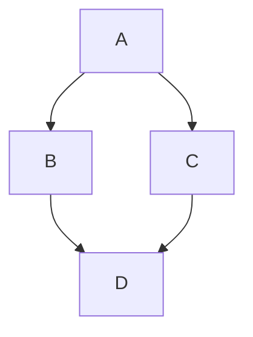
```mermaid
graph TD;
    A-->B;
    A-->C;
    B-->D;
    C-->D;
```

- Результирующее изображение

## Поддерживаемые типы диаграмм

- Блок-схемы (Flowchart)
- Диаграммы состояния (Sequence diagram)
- Диаграммы Ганта (Gantt diagram)
- UML-диаграммы классов (Class diagram)
- Графы git (Git graph)
- ER-диаграммы (Entity Relationship Diagram)
- Диаграммы пользовательского пути (User Journey Diagram)
- Диаграммы последовательности (Sequence diagrams)
- Круговые диаграммы (Pie chart)

## Необходимое программное обеспечение

- Необходимо установить программу mmdc из проекта `https://github.com/mermaid-js/mermaid-cli`.

yarn global add @mermaid-js/mermaid-cli

## Блок-схемы (Flowchart)

### Синтаксис

- Ключевое слово: flowchart и аббревиатуры для указания направления.

- subgraph <имя>: задаёт поддиаграммы.

  - end: завершает описание поддиаграммы.

- Основная часть диаграммы — это узлы.

  - Текст на диаграмме узла берётся из названия.

  - Альтернативно можно указать отображаемый текст в квадратных скобках.

  - Форма узлов задаётся скобочными символами вокруг текста.

  - Для экранирования используют кавычки.

    - Всё содержимое в кавычках считается текстом.

- click: задаёт ссылку для узла.

click <узел> "<ссылка>" <\_blank>

- Ссылка заключается в кавычки.

- \_blank: указывает открыть ссылку в новой вкладке.

- Направление диаграммы:

  - TB: сверху вниз (top to bottom);

  - TD: сверху вниз (top-down);

  - BT: снизу вверх (bottom to top);

  - RL: справа налево (right to left);

  -LR: слева направо (left to right).

- style: задаёт оформление диаграммы.

style <узел> <style_tag:значение>,<style_tag:значение>

- Теги стилей:

  - fill: заливка;

  - stroke: цвет границы;

  - stroke-width: толщина границы;

  - color: цвет текста;

  - stroke-dasharray: пунктирная граница.

- classDef: задаёт класс, содержащий набор стилей.

classDef <имя_класса> <style_tag:значение>,<style_tag:значение>

- ::: указывает класс после имени узла.

### Примеры

- Блок

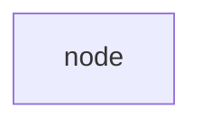
```mermaid
flowchart TB
     node
```

- Блок с текстом

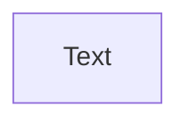
```mermaid
flowchart TB
    node[Text]
```

- Формы узлов

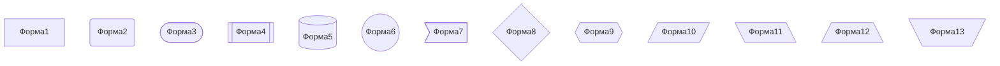
```mermaid
flowchart TB
  node1[Форма1]
  node2(Форма2)
  node3([Форма3])
  node4[[Форма4]]
  node5[(Форма5)]
  node6((Форма6))
  node7>Форма7]
  node8{Форма8}
  node9{{Форма9}}
  node10[/Форма10/]
  node11[\Форма11\]
  node12[/Форма12\]
  node13[\Форма13/]
```

- Стрелки

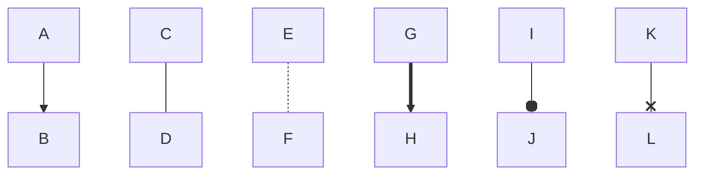
```mermaid
flowchart TB
A-->B
C---D
E-.-F
G==>H
I--oJ
K--xL
```

- Стрелки с текстом

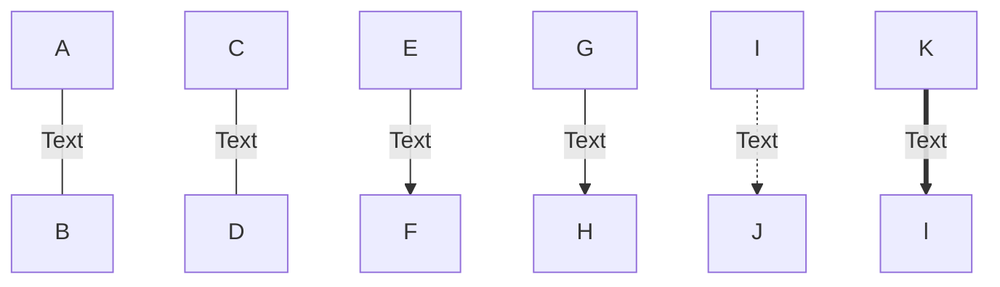
```mermaid
flowchart TD
A--Text---B
C---|Text|D
E-->|Text|F
G--Text-->H
I-.Text.->J
K==Text==>l
```

- Поддиаграммы

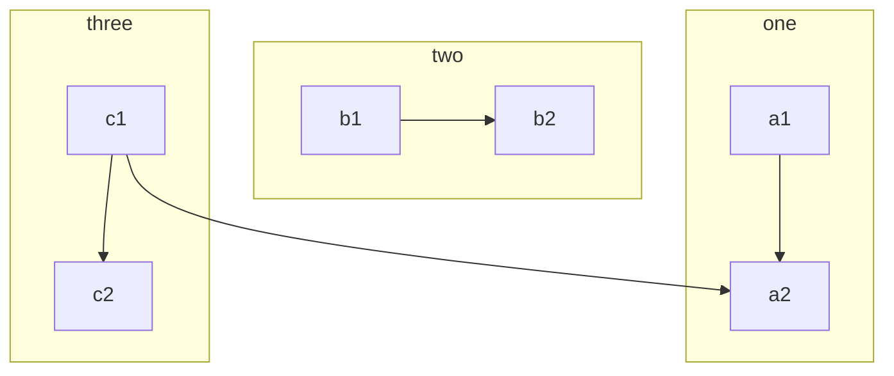
```mermaid
flowchart TB
 c1 --> a2
      subgraph one
          a1 --> a2
      end
      subgraph two
          b1 --> b2
      end
      subgraph three
          c1 --> c2
      end
```

Важно!!! Соблюдать табуляцию!

- Ссылки

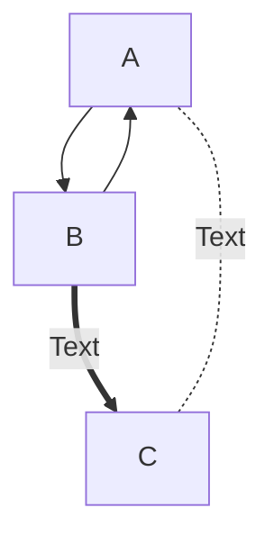
```mermaid
flowchart TB
  A --> B
  B --> A
  B ==Text==> C
  C -.Text.- A
  click A "https://yamadharma.github.io/ru/post/2021/01/03/diagrams-mermaid/" _blank
  click B "http://www.github.com" _blank
```

- Стили

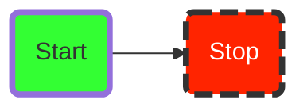
```mermaid
flowchart LR
    id1(Start)-->id2(Stop)
    style id1 fill:#3f3,stroke:3333,stroke-width:4px
    style id2 fill:#ff2400,stroke:#333,stroke-width:4px,color:#fff,stroke-dasharray: 12 5
```

- Классы стилей

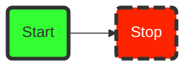
```mermaid
 flowchart LR
      classDef class1 fill:#3f3,stroke:#333,stroke-width:4px
      classDef class2 fill:#ff2400,stroke:#333,stroke-width:4px,color:#fff,stroke-dasharray: 12 5

      A(Start):::class1 --> B(Stop):::class2
```

Basic Pie Chart

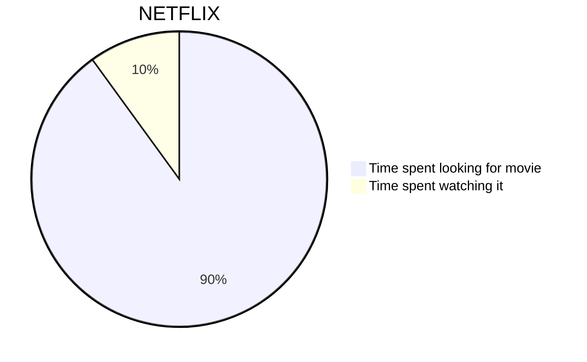
```mermaid
pie title NETFLIX
         "Time spent looking for movie" : 90
         "Time spent watching it" : 10
```

What Voldemort doesn't have?

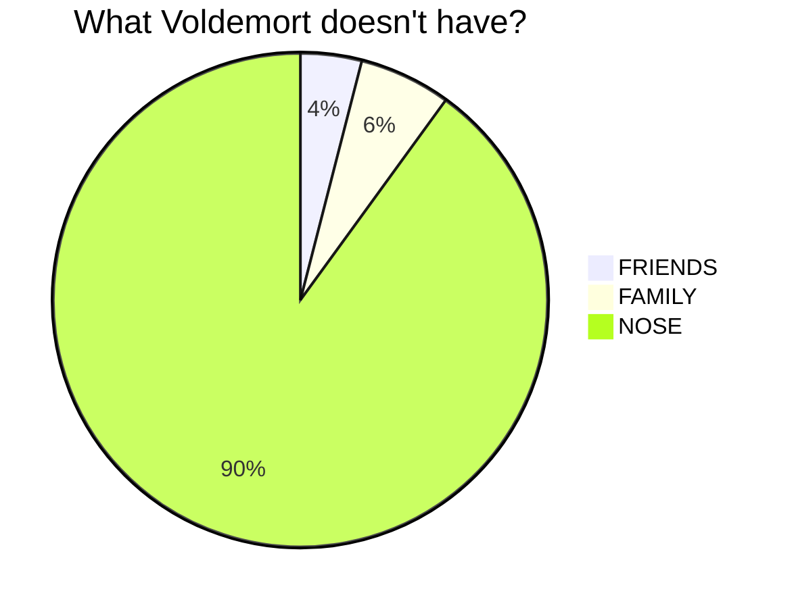
```mermaid
pie title What Voldemort doesn't have?
         "FRIENDS" : 2
         "FAMILY" : 3
         "NOSE" : 45
```

Basic sequence diagram

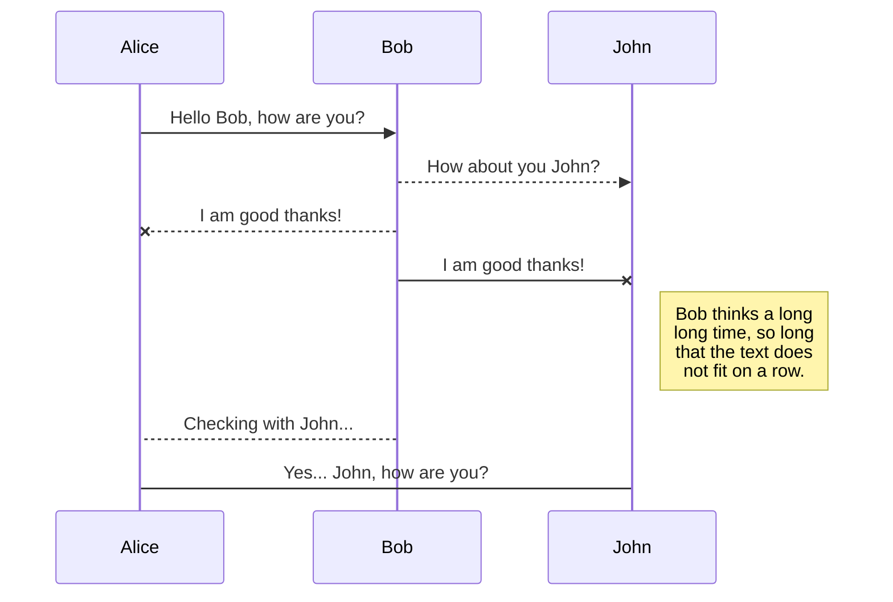
```mermaid
sequenceDiagram
    Alice ->> Bob: Hello Bob, how are you?
    Bob-->>John: How about you John?
    Bob--x Alice: I am good thanks!
    Bob-x John: I am good thanks!
    Note right of John: Bob thinks a long<br/>long time, so long<br/>that the text does<br/>not fit on a row.

    Bob-->Alice: Checking with John...
    Alice->John: Yes... John, how are you?
```

Basic flowchart

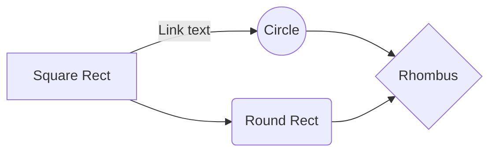
```mermaid
graph LR
    A[Square Rect] -- Link text --> B((Circle))
    A --> C(Round Rect)
    B --> D{Rhombus}
    C --> D
```

Larger flowchart with some styling

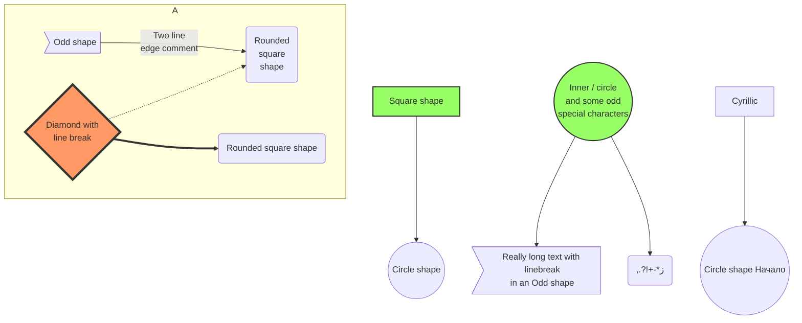
```mermaid
graph TB
    sq[Square shape] --> ci((Circle shape))

    subgraph A
        od>Odd shape]-- Two line<br/>edge comment --> ro
        di{Diamond with <br/> line break} -.-> ro(Rounded<br>square<br>shape)
        di==>ro2(Rounded square shape)
    end

    %% Notice that no text in shape are added here instead that is appended further down
    e --> od3>Really long text with linebreak<br>in an Odd shape]

    %% Comments after double percent signs
    e((Inner / circle<br>and some odd <br>special characters)) --> f(,.?!+-*ز)

    cyr[Cyrillic]-->cyr2((Circle shape Начало));

     classDef green fill:#9f6,stroke:#333,stroke-width:2px;
     classDef orange fill:#f96,stroke:#333,stroke-width:4px;
     class sq,e green
     class di orange
```

SequenceDiagram: Loops, alt and opt

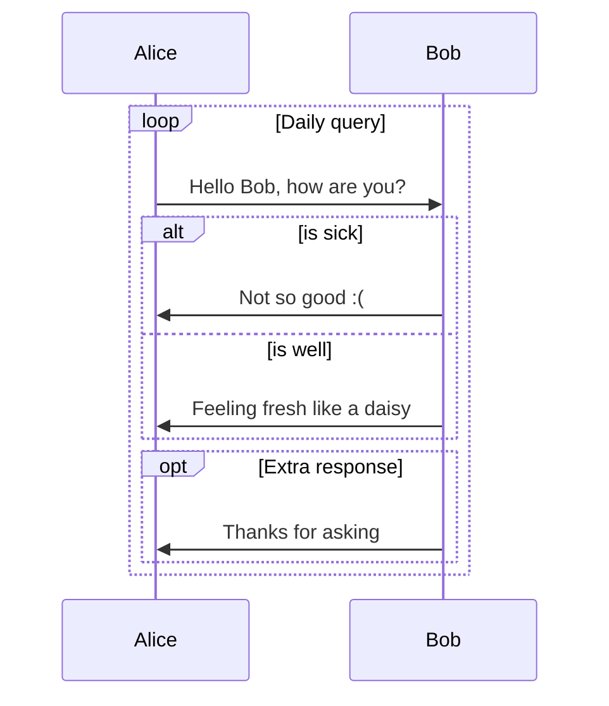
```mermaid
sequenceDiagram
    loop Daily query
        Alice->>Bob: Hello Bob, how are you?
        alt is sick
            Bob->>Alice: Not so good :(
        else is well
            Bob->>Alice: Feeling fresh like a daisy
        end

        opt Extra response
            Bob->>Alice: Thanks for asking
        end
    end
```

SequenceDiagram: Message to self in loop

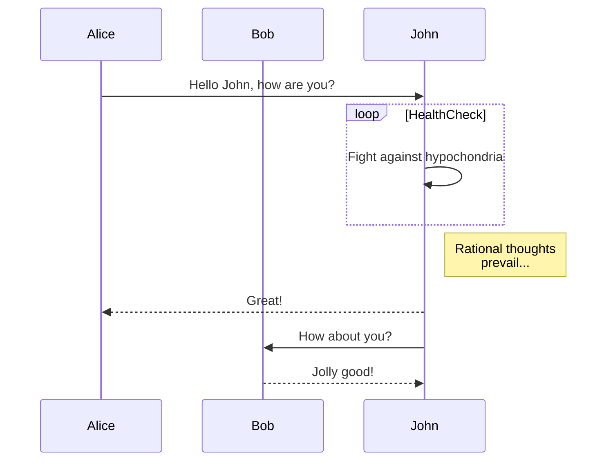
```mermaid
sequenceDiagram
    participant Alice
    participant Bob
    Alice->>John: Hello John, how are you?
    loop HealthCheck
        John->>John: Fight against hypochondria
    end
    Note right of John: Rational thoughts<br/>prevail...
    John-->>Alice: Great!
    John->>Bob: How about you?
    Bob-->>John: Jolly good!
```

Sequence Diagram: Blogging app service communication

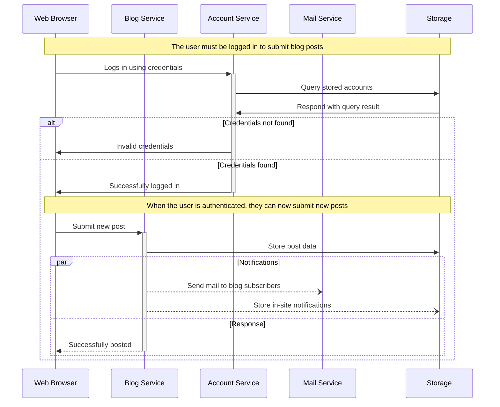
```mermaid
sequenceDiagram
    participant web as Web Browser
    participant blog as Blog Service
    participant account as Account Service
    participant mail as Mail Service
    participant db as Storage

    Note over web,db: The user must be logged in to submit blog posts
    web->>+account: Logs in using credentials
    account->>db: Query stored accounts
    db->>account: Respond with query result

    alt Credentials not found
        account->>web: Invalid credentials
    else Credentials found
        account->>-web: Successfully logged in

        Note over web,db: When the user is authenticated, they can now submit new posts
        web->>+blog: Submit new post
        blog->>db: Store post data

        par Notifications
            blog--)mail: Send mail to blog subscribers
            blog--)db: Store in-site notifications
        and Response
            blog-->>-web: Successfully posted
        end
    end

```

A commit flow diagram.

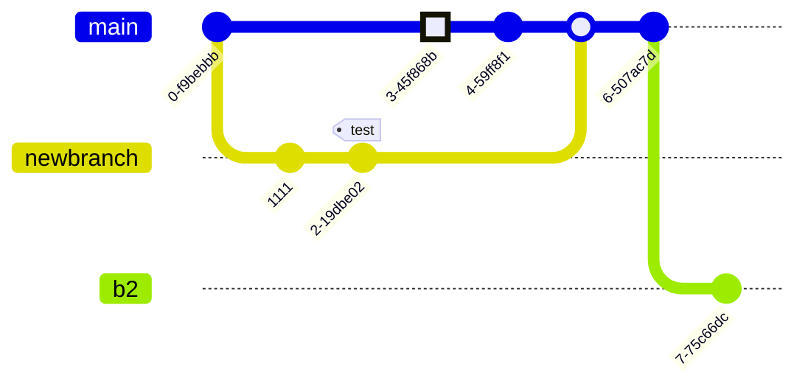
```mermaid
gitGraph:
    commit "Ashish"
    branch newbranch
    checkout newbranch
    commit id:"1111"
    commit tag:"test"
    checkout main
    commit type: HIGHLIGHT
    commit
    merge newbranch
    commit
    branch b2
    commit
```

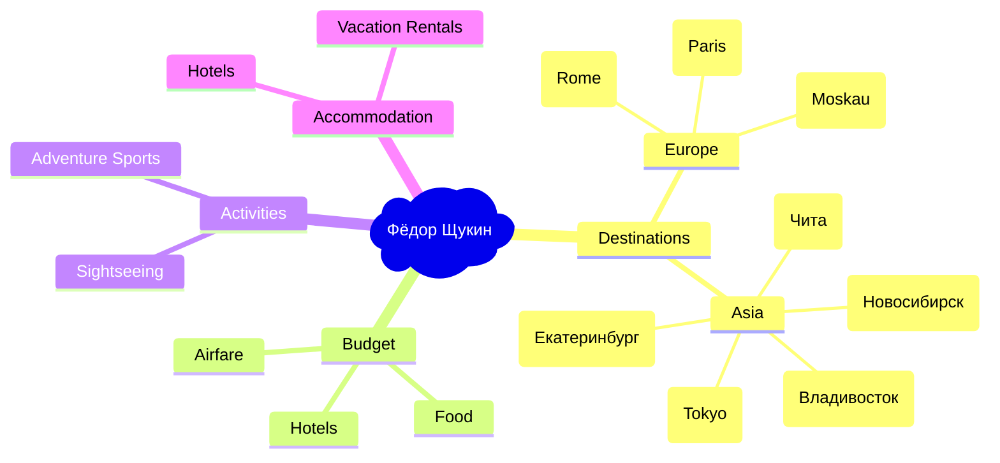
```mermaid
mindmap
      root(Фёдор Щукин))
        Destinations
          Europe
            France(Paris)
            Italy(Rome)
            Russia(Moskau)
          Asia
            Japan(Tokyo)
            Сибирь(Новосибирск)
            Урал(Екатеринбург)
            Забайкалье(Чита)
            Дальний Восток(Владивосток)
        Budget
          Airfare
          Hotels
          Food
        Activities
          Sightseeing
          Adventure Sports
        Accommodation
          Hotels
          Vacation Rentals
```

```mermaid
graph LR;
    A--> B & C & D;
    B--> A & E;
    C--> A & E;
    D--> A & E;
    E--> B & C & D;
```

### Primer

```mermaid
flowchart TB
    A(need diagram) --> B(draw flow chart)
    B(draw flow chart) --> C(reposition arrows)
    C(reposition arrows) --> D(arrows go wonky)
    D(arrows go wonky) --try again--> B(draw flow chart)
    D(arrows go wonky) --> E(give up)
```

Primer

```mermaid
flowchart TB
    A{need diagram} --> B[(draw flow chart)]
    B[(draw flow chart)] --> C((reposition arrows))
    C((reposition arrows)) --> D(arrows go wonky)
    D(arrows go wonky) --try again--> B[(draw flow chart)]
    D(arrows go wonky) ==> E[/give up\]
```

Primer

```mermaid
    classDiagram
    class GameObject {
        -String Name
        -int PosX
        -int PosY
        +Despawn() void
    }
```

Primer

```mermaid
    classDiagram
    class GameObject {
        -String Name
        -int PosX
        -int PosY
        +Despawn() void
    }
    class DamageableObject {
        +int MaxHealth
        -int Health
        +IsDead() bool
        +TakeDamage(int damage) void
        +OnKilled() void
    }
    GameObject <|-- DamageableObject
```

Primer

```mermaid
classDiagram
    note "This is a note for the whole diagram"
    note for Player "This is a note on the Player class"
    class GameObject {
        +String Name
        +int PosX
        +int PosY
        +Despawn() void
    }
    class DamageableObject {
        <<abstract>>
        +int MaxHealth
        -int Health
        +IsDead() bool
        +TakeDamage(int damage) void
        +OnKilled()* void
    }
    class Player {
        -int Score
        -int LivesRemaining
        +OnKilled() void
    }
    class Monster {
        -int ThreatLevel
        -Color Color
        +MakeNoise(double decibelLevel) string
        +OnKilled() void
    }
    GameObject <|-- DamageableObject
    DamageableObject <|-- Player
    DamageableObject <|-- Monster
```

Primer

```mermaid
classDiagram
    Human *-- Cells : composed of
    Salesperson o-- Sales : makes
    Human <|-- Salesperson : is
```

```mermaid
flowchart TB
    A[Deploy to production] ==> B{Is It Friday?}
    B{Is It Friday?} --Yes--> C[Do not deploy!]
    B{Is It Friday?} --Noun--> D[Run deploy.sh to deploy!]
    C[Do not deploy!] --> E[Enjoy your weekend!]
    D[Run deploy.sh to deploy!] --> E[Enjoy your weekend!]
```

## Как исправить коммит

Иногда в только что выполненном коммите нужно что-то поменять: например, добавить ещё пару файлов или заменить сообщение на более информативное.
В таком случае можно внести правки в уже сделанный коммит с помощью опции --amend (от англ. amend — «исправить», «дополнить») у команды commit: git commit --amend. Разберём, как она работает.